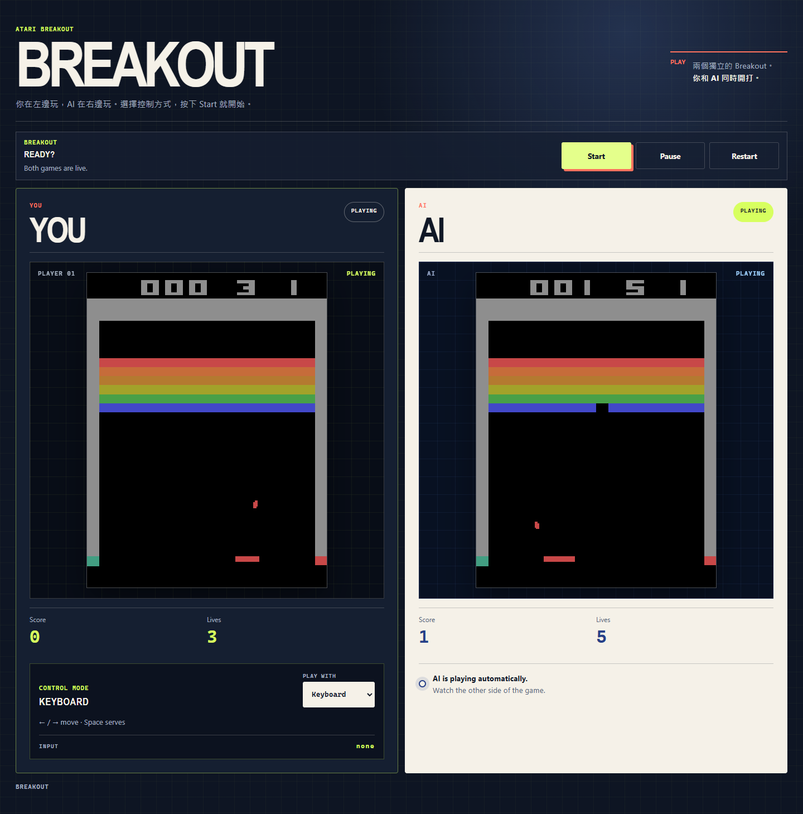

# Breakout RL Engineering

A 30-day reinforcement-learning engineering project that takes Atari Breakout from **environment understanding → DQN training → algorithm comparison → ONNX inference → browser deployment**.

## Play the final result

[](https://breakout.tommypan.dev)

**Live demo:** [breakout.tommypan.dev](https://breakout.tommypan.dev)

The left game is controlled by the player; the right game is controlled by the trained RL agent. ALE and model inference both run in the browser, so the demo does not require a Python backend or GPU server.

## What this repository contains

This is not only a trained Breakout model. The repository records the complete engineering path:

```text
ALE / Gymnasium
      ↓
State, Action, Reward
      ↓
DQN training loop
      ↓
Replay Buffer + Target Network
      ↓
Vectorized CUDA training
      ↓
DQN / Double DQN / Dueling Double DQN
      ↓
Evaluation contract + reproducible experiments
      ↓
PyTorch → ONNX → ONNX Runtime
      ↓
FP32 / FP16 / TensorRT experiments
      ↓
ONNX Runtime Web / WebGPU
      ↓
Playable browser product
```

The original Day 1 story and motivation are preserved in [`docs/day01-project-introduction.md`](docs/day01-project-introduction.md).

## Start here

- **30-day article index:** [`docs/README.md`](docs/README.md)
- **Repository layout and file-placement rules:** [`PROJECT_STRUCTURE.md`](PROJECT_STRUCTURE.md)
- **Coding-agent / article rules:** [`AGENTS.md`](AGENTS.md)
- **Executable tooling:** [`scripts/README.md`](scripts/README.md)
- **Configuration map:** [`configs/README.md`](configs/README.md)
- **Final browser app:** [`web/`](web/)

## Repository map

| Path | Purpose |
| --- | --- |
| [`breakout_rl/`](breakout_rl/) | Reusable RL, training, evaluation, inference, and deployment implementation |
| [`scripts/`](scripts/) | Executable CLIs grouped by training, evaluation, analysis, benchmarks, visualization, demos, and deployment |
| [`configs/`](configs/) | Canonical environment, training, experiment, inference, and deployment definitions |
| [`tests/`](tests/) | Regression and correctness tests |
| [`docs/`](docs/) | Reader-facing 30-day technical articles |
| [`assets/`](assets/) | Curated evidence used by the articles |
| [`experiments/`](experiments/) | Preserved controlled experiment records |
| [`evaluations/`](evaluations/) | Fixed-protocol policy evaluation results |
| [`reports/`](reports/) | Derived engineering summaries |
| [`web/`](web/) | Browser demo and ONNX Runtime Web / WebGPU integration |
| [`design-system/`](design-system/) | UI design-system support for the browser demo |

`breakout_env.py` is a documented historical exception kept at the root for compatibility; new reusable Python implementation should go under `breakout_rl/`.

## Environment

The Python environment is defined by:

```text
environment.yml
```

A locked snapshot is also preserved as:

```text
environment.lock.yml
```

Typical setup:

```bash
conda env create -f environment.yml
conda activate breakout-rl-engineering
```

Run executable tools from the repository root with module syntax:

```bash
python -m scripts.training.train_vectorized_dqn --help
python -m scripts.evaluation.evaluate_dqn --help
python -m scripts.analysis.analyze_q_values --help
```

## Canonical Breakout task contract

From Day 16 onward, training, evaluation, gameplay recording, and deployment parity checks share the machine-readable contract:

```text
configs/eval/breakout_contract_v2.json
```

This freezes the task-defining semantics such as frame skip/stack, sticky actions, FIRE ownership, life-loss handling, evaluation seeds, reward handling, and episode limits so that algorithm comparisons remain meaningful.

## 30-day roadmap

| Phase | Days | Focus |
| --- | ---: | --- |
| RL foundations | 1–6 | ALE, Gymnasium, observations, rewards, MDP, Q-Learning |
| Build DQN | 7–15 | CNN, replay buffer, exploration, target network, training/debugging |
| Improve training | 16–21 | Vectorized CUDA training, Double DQN, Dueling DQN, long training |
| Model engineering | 22–26 | ONNX export, runtime inference, benchmarking, precision, TensorRT |
| Browser product | 27–30 | ONNX Runtime Web, WebGPU, interactive demo, final validation |

See [`docs/README.md`](docs/README.md) for links to every article.

## Artifact policy

The repository intentionally keeps reproducible evidence, but different output types have different homes:

- local disposable runs → `runs/` (ignored by default)
- controlled experiments worth preserving → `experiments/`
- fixed-protocol policy evaluations → `evaluations/`
- figures/traces used by articles → `assets/dayXX/`
- summaries derived from evidence → `reports/`

This prevents the project root from becoming a second experiment-output directory.

## Project goal

The main goal was to understand the full lifecycle rather than stop at `train()`:

> make an agent learn Breakout, measure whether it actually learned, compare algorithm changes fairly, export the model, optimize inference, and finally ship the policy as something people can use in a browser.
