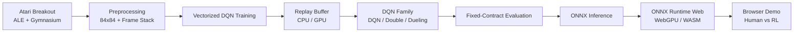

# Breakout RL Engineering

> End-to-end reinforcement learning engineering for Atari Breakout — from DQN training and reproducible evaluation to CUDA acceleration, ONNX inference, and a browser-deployed RL agent.

[**Live Demo**](https://breakout.tommypan.dev) · [**30-Day Ironman Series**](https://github.com/Tommyweige/breakout-rl-engineering/tree/docs-ironman-series/docs)

這不是單純「把 DQN 跑起來」的練習專案，而是把 Atari Breakout 從研究原型一路整理成可以訓練、比較、驗證、最佳化並部署的完整 RL engineering pipeline。

最終成品可以直接在瀏覽器中遊玩：**左側由玩家控制，右側由訓練完成的 RL Agent 控制**。遊戲模擬與模型推論都在瀏覽器端執行，不需要 Python backend。

## What this project covers

- **Atari environment engineering** — Gymnasium + ALE、Atari preprocessing、frame stacking、固定 task semantics。
- **DQN family** — Vanilla DQN、Double DQN、Dueling Double DQN。
- **Training systems** — PyTorch、CUDA、vectorized environments、CPU / GPU Replay Buffer、可重現 seed 與 metrics。
- **Evaluation discipline** — 固定 environment / evaluation contract，避免訓練與評估條件悄悄漂移。
- **Inference engineering** — PyTorch / ONNX / ONNX Runtime 的模型與推論流程。
- **Browser deployment** — ALE WASM + ONNX Runtime Web / WebGPU，將 RL Agent 直接帶進瀏覽器。
- **Engineering quality** — reusable package、CLI separation、regression tests、locked environment 與明確 artifact boundary。

## End-to-end pipeline



## Live demo

**Play:** https://breakout.tommypan.dev

瀏覽器端主要由以下元件組成：

- `@farama/ale-wasm`：在瀏覽器執行 Atari emulator。
- `onnxruntime-web`：載入並執行訓練完成的 ONNX policy。
- TypeScript + Vite：遊戲、推論與 UI application。
- WebGPU / WASM：依瀏覽器能力執行模型推論。

因此 Demo 並不是影片或預先錄製結果，而是一個真正執行 Atari 環境與 RL policy 的 browser application。

## Engineering decisions

### 1. Environment semantics are treated as part of the model

Atari RL 很容易因為 frame skip、frame stack、sticky actions、FIRE handling、life-loss handling 或 episode limit 不一致，導致不同實驗其實不是在比較同一件事。

本專案將這些條件固定在 machine-readable contract：

```text
configs/eval/breakout_contract_v2.json
```

training、evaluation 與相關 runtime 都以同一份 contract 為 task semantics 的來源。

### 2. Reusable logic and executable workflows are separated

核心實作放在 `breakout_rl/`，CLI 只負責 orchestration：

```text
breakout_rl/   reusable RL / training / evaluation / inference code
scripts/       training / evaluation / analysis / benchmark entry points
configs/       active task, baseline, evaluation and inference configs
tests/         correctness and regression tests
web/           production browser application and runtime assets
```

這讓訓練邏輯不會被綁死在某個 notebook、某一天的實驗腳本或單一 CLI 裡。

### 3. Training is built as a system, not only an algorithm

除了 DQN 本身，專案也處理實際訓練會遇到的 systems 問題，包括：

- vectorized Breakout environments
- replay memory layout and sampling
- CPU / GPU replay paths
- CUDA execution
- target-network updates
- epsilon-greedy exploration
- training metrics and diagnostics
- deterministic / fixed-seed evaluation

## Repository structure

```text
.
├── breakout_env.py          # Breakout environment compatibility layer
├── breakout_rl/             # reusable Python implementation
│   ├── models/              # Q-network architectures / factory
│   ├── training/            # DQN training system
│   ├── evaluation.py        # policy evaluation
│   ├── evaluation_contract.py
│   ├── replay.py            # CPU replay buffer
│   ├── replay_gpu.py        # GPU replay buffer
│   ├── inference.py         # inference runtime helpers
│   └── ...
├── configs/
│   ├── eval/                # canonical Breakout evaluation contract
│   └── inference/           # inference specification
├── scripts/
│   ├── training/
│   ├── evaluation/
│   ├── analysis/
│   └── benchmarks/
├── tests/
├── web/                     # browser demo
├── environment.yml
└── environment.lock.yml
```

The 30-day development articles and their visual evidence are kept separately on the [`docs-ironman-series`](https://github.com/Tommyweige/breakout-rl-engineering/tree/docs-ironman-series) branch so that `main` stays focused on maintained code.

## Quick start — Python

### Requirements

- Python 3.12
- NVIDIA GPU recommended for CUDA training
- Conda / Miniconda

Create the environment:

```bash
conda env create -f environment.yml
conda activate breakout-rl-engineering
```

The project environment includes PyTorch CUDA, Gymnasium, ALE, ONNX and ONNX Runtime GPU. Exact pinned versions are also recorded in `environment.lock.yml`.

### Train

Single-environment DQN:

```bash
python -m scripts.training.train_dqn --help
```

Vectorized training:

```bash
python -m scripts.training.train_vectorized_dqn --preset smoke --device cuda
```

The vectorized trainer supports configurable DQN-family training, environment count, Replay Buffer backend and CUDA execution.

### Evaluate

```bash
python -m scripts.evaluation.evaluate_dqn --help
python -m scripts.evaluation.evaluate_vectorized_dqn --help
```

A random-agent baseline is also available:

```bash
python -m scripts.evaluation.baseline_random_agent --help
```

## Quick start — Web

Requires **Node.js >= 20.19**.

```bash
cd web
npm install
npm run dev
```

Quality checks:

```bash
npm run typecheck
npm test
npm run build
```

Production build uses Vite and prepares the required ALE / evaluation-contract runtime assets before bundling.

## Tech stack

| Area | Stack |
| --- | --- |
| RL environment | Gymnasium, ALE / `ale-py` |
| Training | PyTorch, CUDA, NumPy |
| Algorithms | DQN, Double DQN, Dueling DQN |
| Evaluation | fixed seeds, canonical Breakout contract |
| Model interchange | ONNX |
| Native inference | ONNX Runtime GPU |
| Browser inference | ONNX Runtime Web, WebGPU / WASM |
| Browser Atari runtime | `@farama/ale-wasm` |
| Web application | TypeScript, Vite |
| Testing | Python regression tests, Vitest |

## Project history

這個專案最初以 30 天系列的形式逐步建立：從 Atari / Gymnasium、MDP、DQN 基礎開始，之後進入 Replay Buffer、Target Network、CUDA 訓練、Double / Dueling DQN、推論最佳化、ONNX，最後完成 browser deployment。

完整文章保留在：

**[`docs-ironman-series`](https://github.com/Tommyweige/breakout-rl-engineering/tree/docs-ironman-series/docs)**

目前 `main` 則只維護最終留下來的核心 implementation、tests、configs 與 Web application。
