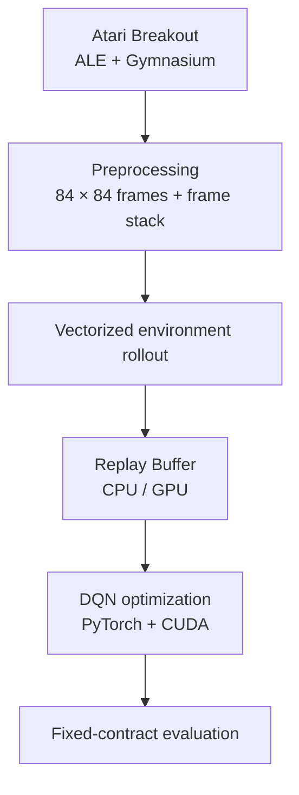
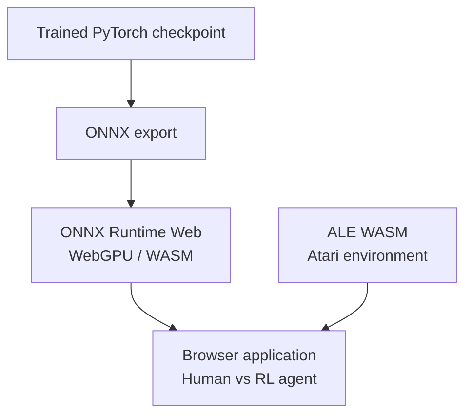

# Breakout RL Engineering

[繁體中文](README.zh-TW.md) · [Live Demo](https://breakout.tommypan.dev) · [30-Day Ironman Series](https://github.com/Tommyweige/breakout-rl-engineering/tree/docs-ironman-series/docs)

An end-to-end reinforcement learning engineering project for Atari Breakout, covering DQN training, reproducible evaluation, CUDA-accelerated workflows, ONNX inference, and browser deployment.

The final application runs both the Atari environment and the trained RL policy directly in the browser, without a Python backend.

## Highlights

- **DQN family** — Vanilla DQN, Double DQN, and Dueling Double DQN.
- **GPU training** — PyTorch with CUDA support and vectorized environments.
- **Replay systems** — CPU and GPU replay-buffer implementations.
- **Reproducible evaluation** — fixed environment and evaluation semantics through a machine-readable contract.
- **Inference pipeline** — PyTorch to ONNX and ONNX Runtime.
- **Browser deployment** — Atari emulation with ALE WASM and policy inference with ONNX Runtime Web.
- **Engineering structure** — reusable Python package, CLI entry points, active configs, regression tests, and a production web app.

## Architecture

### Training and evaluation



The training path supports Vanilla DQN, Double DQN, and Dueling Double DQN under the same environment and evaluation contract.

### Deployment



The deployed browser application combines the Atari emulator and the ONNX policy locally, so gameplay and inference do not require a Python backend.

## Project Structure

```text
breakout_rl/   Reusable RL, training, evaluation, and inference code
configs/       Active training, evaluation, and inference configuration
scripts/       Training, evaluation, analysis, and benchmark CLIs
tests/         Core correctness and regression tests
web/           Browser application and runtime model assets
```

The `main` branch contains the maintained implementation and product code. The 30-day article series and its documentation assets are maintained separately on the [`docs-ironman-series`](https://github.com/Tommyweige/breakout-rl-engineering/tree/docs-ironman-series) branch.

## Environment Contract

Atari RL results are sensitive to environment semantics such as frame skip, frame stack, sticky actions, FIRE handling, life-loss handling, and episode limits.

This project keeps the canonical evaluation semantics in:

```text
configs/eval/breakout_contract_v2.json
```

The same contract is used as the reference for training and evaluation workflows.

## Training

The maintained training entry points are:

```text
scripts/training/train_dqn.py
scripts/training/train_vectorized_dqn.py
```

The vectorized training path is designed for higher-throughput collection and CUDA-backed optimization.

Available baseline configurations include:

```text
configs/dqn_baseline.json
configs/double_dqn_baseline.json
configs/dueling_double_dqn_baseline.json
```

## Evaluation

Maintained evaluation entry points:

```text
scripts/evaluation/baseline_random_agent.py
scripts/evaluation/evaluate_dqn.py
scripts/evaluation/evaluate_vectorized_dqn.py
```

Evaluation is separated from training so model comparisons can run under consistent task semantics.

## Browser Demo

**Live:** https://breakout.tommypan.dev

The web application uses:

- [`@farama/ale-wasm`](https://www.npmjs.com/package/@farama/ale-wasm) for Atari emulation in the browser.
- [`onnxruntime-web`](https://www.npmjs.com/package/onnxruntime-web) for policy inference.
- TypeScript and Vite for the browser application.
- WebGPU or WASM execution paths depending on browser capability.

Runtime model assets are stored under `web/public/` because they are required by the deployed application.

## Quick Start

### Python

```bash
conda env create -f environment.yml
conda activate breakout-rl-engineering

python -m scripts.training.train_vectorized_dqn --help
python -m scripts.evaluation.evaluate_dqn --help
```

The current environment targets Python 3.12 and includes PyTorch with CUDA support, Gymnasium, ALE, ONNX, and ONNX Runtime GPU.

### Web

```bash
cd web
npm install
npm run dev
```

Production build:

```bash
npm run build
```

## Tech Stack

**RL / ML**

- Python 3.12
- PyTorch
- Gymnasium
- ALE / `ale-py`
- NumPy

**Inference / Deployment**

- ONNX
- ONNX Runtime GPU
- ONNX Runtime Web
- WebGPU / WASM

**Web**

- TypeScript
- Vite
- Vitest
- Cloudflare Pages / Wrangler

## Documentation

The development notes and 30-day Ironman series are available on the documentation branch:

[**Browse the 30-Day Ironman Series →**](https://github.com/Tommyweige/breakout-rl-engineering/tree/docs-ironman-series/docs)