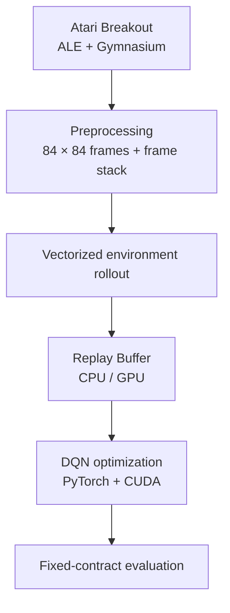
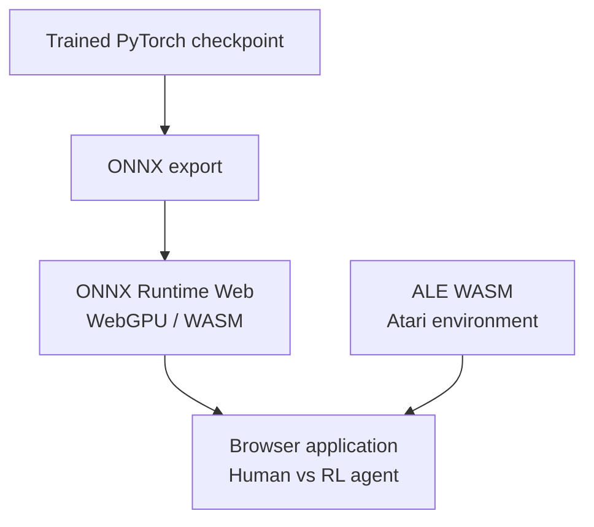

# Breakout RL Engineering

[繁體中文](README.zh-TW.md) · [Live Demo](https://breakout.tommypan.dev) · [30-Day Ironman Series](https://github.com/Tommyweige/breakout-rl-engineering/tree/docs-ironman-series/docs)

An end-to-end reinforcement learning engineering project for Atari Breakout, covering DQN training, reproducible evaluation, CUDA-accelerated workflows, ONNX inference, and browser deployment.

The final application runs both the Atari environment and the trained RL policy directly in the browser, without a Python backend.

## Highlights

### Optional Laya Vision research evaluator

Issue [#69](https://github.com/Tommyweige/breakout-rl-engineering/issues/69)
adds a frozen 201M pixel-only policy, isolated from DQN training and the browser.
With the project Conda environment active, create an optional environment:

```powershell
python -m venv --system-site-packages .venv-laya
.\.venv-laya\Scripts\python -m pip install -r requirements-laya.txt
.\.venv-laya\Scripts\python -m scripts.evaluation.evaluate_laya_vision --mode pilot --output-dir evaluations/laya-pilot
```

Upstream code is pinned to `9e1e2419d855ad3e1a2af4d4bd1ef6be5418842c`;
`thaitea/laya-vision` weights are pinned to
`f2fe3c12cb6d04c59d8a190250bf3fb40fc828dc`. Installation checks the Git commit.
Code is Apache 2.0; weights are CC BY-NC-SA 4.0 and are not redistributed.
The inherited environment must provide the existing PyTorch/CUDA/ALE dependencies;
the tested combination is PyTorch 2.13.0+cu130, torchvision 0.28.0 and transformers 5.3.0.

The default protocol runs 100 measured model decisions after warm-up, then gates
the predeclared v2 seeds 101/202/303 against a one-hour estimated maximum compute
budget. `--mode seed101` selects the required single-seed evaluation; `--mode full`
selects the contract's 15 seeds. Declare a different budget before running with
`--max-pilot-hours`. The gate uses measured p95 latency and the unchanged episode
limit; smoke never counts as a complete episode. Each run requires a fresh output
directory and writes `run.json`, `report.md`, compact action traces, three smoke
frames, and shared evaluator JSON/CSV for completed episodes.

Decisions use one ALE RGB render, never the DQN grayscale stack, RAM or completion
detector state. The environment retains its exact preprocessing/serve behavior;
requested and wrapper-executed actions are recorded separately. Model timing
includes the image tower, connector and decision network; a separate fixed-frame
benchmark measures upstream image preprocessing. Reported confidence is not
validated as calibrated on this ALE domain. GPU load measurements target the
RTX 4060 Laptop 8 GB; unavailable/unsupported CUDA falls back to CPU with provenance.

The existing Day 21 DQN ONNX asset is re-evaluated on the same v2 seeds using
ONNX Runtime CPU, with model and inference-contract hashes checked. It runs even
when the Laya latency gate blocks gameplay. Compare completed matched-contract
episodes only; v3 (`--contract configs/eval/breakout_contract_v3.json`) is reported
separately, with its optional predictive-controller comparison unrun.
Keep generated evidence under ignored `evaluations/`, outside `main`.
Optional real-model integration tests require cached weights and
`LAYA_RUN_INTEGRATION=1`; ordinary tests use a mocked external Laya policy.

- **DQN family** — Vanilla DQN, Double DQN, and Dueling Double DQN.
- **GPU training** — PyTorch with CUDA support and vectorized environments.
- **Replay systems** — CPU and GPU replay-buffer implementations.
- **Reproducible evaluation** — fixed environment and evaluation semantics through a machine-readable contract.
- **Inference pipeline** — PyTorch to ONNX and ONNX Runtime.
- **Browser deployment** — Atari emulation with ALE WASM and policy inference with ONNX Runtime Web.
- **Engineering structure** — reusable Python package, CLI entry points, active configs, regression tests, and a production web app.

## Architecture

### Training and evaluation


```mermaid
flowchart TB
    A["Atari Breakout<br/>ALE + Gymnasium"]
    B["Preprocessing<br/>84 × 84 frames + frame stack"]
    C["Vectorized environment rollout"]
    D["Replay Buffer<br/>CPU / GPU"]
    E["DQN optimization<br/>PyTorch + CUDA"]
    F["Fixed-contract evaluation"]

    A --> B --> C --> D --> E --> F
```

The training path supports Vanilla DQN, Double DQN, and Dueling Double DQN under the same environment and evaluation contract.

### Deployment


```mermaid
flowchart TB
    A["Trained PyTorch checkpoint"]
    B["ONNX export"]
    C["ONNX Runtime Web<br/>WebGPU / WASM"]
    D["Browser application<br/>Human vs RL agent"]
    E["ALE WASM<br/>Atari environment"]

    A --> B --> C --> D
    E --> D
```

The deployed browser application combines the Atari emulator and the ONNX policy locally, so gameplay and inference do not require a Python backend.

## Project Structure

```text
breakout_rl/   Reusable RL, training, evaluation, and inference code
configs/       Active training, evaluation, and inference configuration
scripts/       Training, evaluation, analysis, and benchmark CLIs
tests/         Core correctness and regression tests
web/           Browser application and runtime model assets
```

The `main` branch contains the maintained implementation and product code. The 30-day article series and its documentation assets are maintained separately on the [`docs-ironman-series`](https://github.com/Tommyweige/breakout-rl-engineering/tree/docs-ironman-series) branch.

## Environment Contract

Atari RL results are sensitive to environment semantics such as frame skip, frame stack, sticky actions, FIRE handling, life-loss handling, and episode limits.

The historical benchmark contract remains:

```text
configs/eval/breakout_contract_v2.json
```

Precision-control training and evaluation can select:

```text
configs/eval/breakout_contract_v3.json
```

Contract v2 makes one policy decision per four emulator frames. Contract v3
makes one decision per emulator frame while keeping the same 108,000-frame ALE
episode limit and other gameplay settings. Thus the corresponding agent-step
limits are 27,000 and 108,000. Training and evaluation summaries keep agent
steps separate from emulator frames, which are read from ALE's native counter.
Select v3 explicitly with `--contract configs/eval/breakout_contract_v3.json`;
the default remains v2. Use the contract ID and path recorded in each artifact
when comparing results.

## Training

The maintained training entry points are:

```text
scripts/training/train_dqn.py
scripts/training/train_vectorized_dqn.py
```

The vectorized training path is designed for higher-throughput collection and CUDA-backed optimization.

Available baseline configurations include:

```text
configs/dqn_baseline.json
configs/double_dqn_baseline.json
configs/dueling_double_dqn_baseline.json
configs/dueling_double_dqn_life_loss_penalty.json
```

The Issue #9 reward-shaping experiment keeps the raw Atari reward separate
from the replay/training reward. The baseline uses `life_loss_penalty: 0.0`
and the experiment uses `-1.0`, applied only when
`info["fire_reset_life_loss"]` is true. Evaluation always reports the raw
Breakout score.

The reproducible Stage 2 screening sweep uses Dueling Double DQN, seed `2022`,
`250000` environment transitions, and otherwise identical configs for penalties
`0.0`, `-0.25`, `-0.5`, and `-1.0`:

```bash
python -m scripts.training.run_reward_shaping_sweep \
  --output-dir experiments/issue-9-reward-shaping/stage2-250k --parallel
python -m scripts.evaluation.evaluate_reward_shaping_sweep \
  --stage-dir experiments/issue-9-reward-shaping/stage2-250k
```

Each run saves its config, checkpoints, metrics, runtime summary, Q/TD-error
diagnostics, survival metrics, analysis report, and learning curves. The
evaluation uses the predeclared 50-seed raw-score protocol. Stage 2 is candidate
screening; it does not promote a model or replace the formal Day 30 artifacts.

## Evaluation

Maintained evaluation entry points:

```text
scripts/evaluation/baseline_random_agent.py
scripts/evaluation/evaluate_dqn.py
scripts/evaluation/evaluate_vectorized_dqn.py
scripts/evaluation/evaluate_reward_shaping.py
scripts/evaluation/evaluate_reward_shaping_sweep.py
scripts/evaluation/evaluate_predictive_controller.py
```

Evaluation is separated from training so model comparisons can run under consistent task semantics.

The deterministic predictive controller uses raw ALE RGB pixels and does not
train a model. Its versioned config references Breakout Contract v3, preserving
the one-frame decision cadence and fixed evaluation seeds without changing the
shared v2 or v3 contracts:

```bash
python -m scripts.evaluation.evaluate_predictive_controller \
  --config configs/eval/breakout_vision_controller_v1.json \
  --output-dir outputs/issue25-vision-controller
```

The run writes per-episode scores and canonical clear detections, perception/control
diagnostics, a first-episode ALE step trace, and a compact comparison report.
The controller consumes screen frames only; FIRE handling and canonical clear
detection stay in the external environment/evaluation pipeline. Clear counts use
the audited `BreakoutCompletionDetector`; they do not establish the repository's
`verified_clears`, which requires separate contract/source/provenance validation.
Trace and distribution fields distinguish `requested_action` (controller decision)
from `ale_input_action` (after FIRE wrapper overrides, sent to ALE). ALE sticky
actions may repeat a previous action; the physical action resolved by ALE is not observed.

## Browser Demo

**Live:** https://breakout.tommypan.dev

The web application uses:

- [`@farama/ale-wasm`](https://www.npmjs.com/package/@farama/ale-wasm) for Atari emulation in the browser.
- [`onnxruntime-web`](https://www.npmjs.com/package/onnxruntime-web) for policy inference.
- TypeScript and Vite for the browser application.
- WebGPU or WASM execution paths depending on browser capability.

Runtime model assets are stored under `web/public/` because they are required by the deployed application.

## Quick Start

### Python

```bash
conda env create -f environment.yml
conda activate breakout-rl-engineering

python -m scripts.training.train_vectorized_dqn --help
python -m scripts.evaluation.evaluate_dqn --help
```

The current environment targets Python 3.12 and includes PyTorch with CUDA support, Gymnasium, ALE, ONNX, and ONNX Runtime GPU.

### Web

```bash
cd web
npm install
npm run dev
```

Production build:

```bash
npm run build
```

## Tech Stack

**RL / ML**

- Python 3.12
- PyTorch
- Gymnasium
- ALE / `ale-py`
- NumPy

**Inference / Deployment**

- ONNX
- ONNX Runtime GPU
- ONNX Runtime Web
- WebGPU / WASM

**Web**

- TypeScript
- Vite
- Vitest
- Cloudflare Pages / Wrangler

## Documentation

The development notes and 30-day Ironman series are available on the documentation branch:

[**Browse the 30-Day Ironman Series →**](https://github.com/Tommyweige/breakout-rl-engineering/tree/docs-ironman-series/docs)
