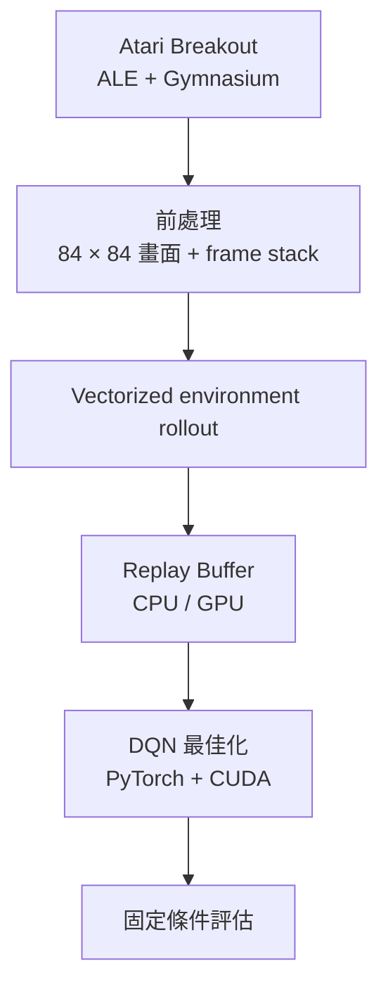
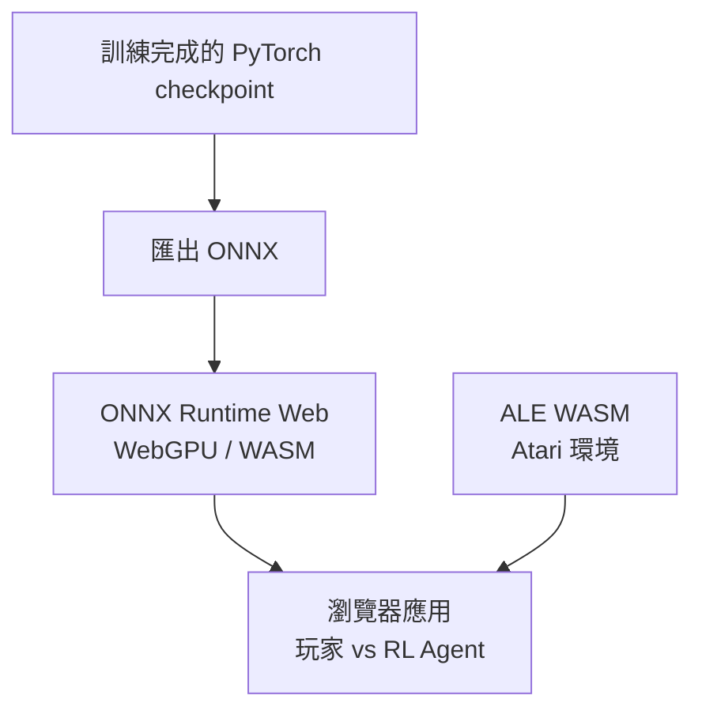

# Breakout RL Engineering

[English](README.md) · [線上 Demo](https://breakout.tommypan.dev) · [30 天鐵人賽文章](https://github.com/Tommyweige/breakout-rl-engineering/tree/docs-ironman-series/docs)

這是一個以 Atari Breakout 為主題的端到端強化學習工程專案，涵蓋 DQN 訓練、可重現評估、CUDA 加速、ONNX 推論，以及瀏覽器部署。

最終應用會直接在瀏覽器中執行 Atari 環境與訓練完成的 RL policy，不需要 Python backend。

## 專案重點

- **DQN 系列模型** — Vanilla DQN、Double DQN、Dueling Double DQN。
- **GPU 訓練** — 使用 PyTorch、CUDA 與 vectorized environments。
- **Replay 系統** — CPU 與 GPU Replay Buffer 實作。
- **可重現評估** — 透過 machine-readable contract 固定環境與評估語義。
- **推論流程** — PyTorch、ONNX 與 ONNX Runtime。
- **瀏覽器部署** — 使用 ALE WASM 執行 Atari，並以 ONNX Runtime Web 執行 policy inference。
- **工程化結構** — reusable Python package、CLI、active configs、regression tests 與 production web app。

## 系統架構

### 訓練與評估



Vanilla DQN、Double DQN 與 Dueling Double DQN 都使用相同的環境與評估 contract，方便在一致條件下比較。

### 部署流程



瀏覽器端會同時執行 Atari emulator 與 ONNX policy，因此遊戲與模型推論都不需要 Python backend。

## 專案結構

```text
breakout_rl/   可重用的 RL、訓練、評估與推論程式碼
configs/       目前使用中的訓練、評估與推論設定
scripts/       訓練、評估、分析與 benchmark CLI
tests/         核心 correctness 與 regression tests
web/           瀏覽器應用與 runtime model assets
```

`main` 分支只保留目前維護中的實作與產品程式碼。30 天鐵人賽文章與對應文件資產放在 [`docs-ironman-series`](https://github.com/Tommyweige/breakout-rl-engineering/tree/docs-ironman-series) 分支。

## Environment Contract

Atari RL 的結果會受到 frame skip、frame stack、sticky actions、FIRE handling、life-loss handling 與 episode limit 等環境條件影響。

本專案將 canonical evaluation semantics 固定在：

```text
configs/eval/breakout_contract_v2.json
```

訓練與評估流程都以這份 contract 作為環境與任務語義的參考。

## 訓練

目前保留的訓練入口：

```text
scripts/training/train_dqn.py
scripts/training/train_vectorized_dqn.py
```

Vectorized training path 用於提高資料收集 throughput，並搭配 CUDA 執行模型最佳化。

Baseline 設定包含：

```text
configs/dqn_baseline.json
configs/double_dqn_baseline.json
configs/dueling_double_dqn_baseline.json
configs/dueling_double_dqn_life_loss_penalty.json
```

Issue #9 的 reward shaping 實驗會把 raw Atari reward 與 replay/training
reward 分開保存。Baseline 使用 `life_loss_penalty: 0.0`，實驗版本使用
`-1.0`，而且只在 `info["fire_reset_life_loss"]` 為 true 時套用。評估時
仍然只回報原始 Breakout 分數。

Stage 2 的可重現 screening sweep 使用 Dueling Double DQN、training seed
`2022`、`250000` 個 environment transitions；除了 penalty 之外的條件
完全一致，比較 `0.0`、`-0.25`、`-0.5`、`-1.0`：

```bash
python -m scripts.training.run_reward_shaping_sweep \
  --output-dir experiments/issue-9-reward-shaping/stage2-250k --parallel
python -m scripts.evaluation.evaluate_reward_shaping_sweep \
  --stage-dir experiments/issue-9-reward-shaping/stage2-250k
```

每個 run 都會保存 config、checkpoint、metrics、runtime summary、Q/TD-error
diagnostics、survival metrics、analysis report 與 learning curves。評估使用
預先宣告的 50 組 seed，且只比較 raw score。Stage 2 只是 candidate screening，
不會提升任何模型，也不會覆蓋既有 Day 30 formal artifacts。

## 評估

目前保留的評估入口：

```text
scripts/evaluation/baseline_random_agent.py
scripts/evaluation/evaluate_dqn.py
scripts/evaluation/evaluate_vectorized_dqn.py
scripts/evaluation/evaluate_reward_shaping.py
scripts/evaluation/evaluate_reward_shaping_sweep.py
```

評估流程與訓練流程分離，讓不同模型能在一致的 task semantics 下進行比較。

## 瀏覽器 Demo

**線上版本：** https://breakout.tommypan.dev

Web application 使用：

- [`@farama/ale-wasm`](https://www.npmjs.com/package/@farama/ale-wasm)：在瀏覽器執行 Atari emulator。
- [`onnxruntime-web`](https://www.npmjs.com/package/onnxruntime-web)：執行訓練完成的 policy。
- TypeScript + Vite：瀏覽器應用。
- WebGPU / WASM：依照瀏覽器能力選擇推論執行路徑。

部署所需的 runtime model assets 保留在 `web/public/`。

## 快速開始

### Python

```bash
conda env create -f environment.yml
conda activate breakout-rl-engineering

python -m scripts.training.train_vectorized_dqn --help
python -m scripts.evaluation.evaluate_dqn --help
```

目前環境使用 Python 3.12，並包含 PyTorch CUDA、Gymnasium、ALE、ONNX 與 ONNX Runtime GPU。

### Web

```bash
cd web
npm install
npm run dev
```

Production build：

```bash
npm run build
```

## 技術棧

**RL / ML**

- Python 3.12
- PyTorch
- Gymnasium
- ALE / `ale-py`
- NumPy

**Inference / Deployment**

- ONNX
- ONNX Runtime GPU
- ONNX Runtime Web
- WebGPU / WASM

**Web**

- TypeScript
- Vite
- Vitest
- Cloudflare Pages / Wrangler

## 文件

開發筆記與 30 天鐵人賽文章放在文件分支：

[**瀏覽 30 天鐵人賽文章 →**](https://github.com/Tommyweige/breakout-rl-engineering/tree/docs-ironman-series/docs)
