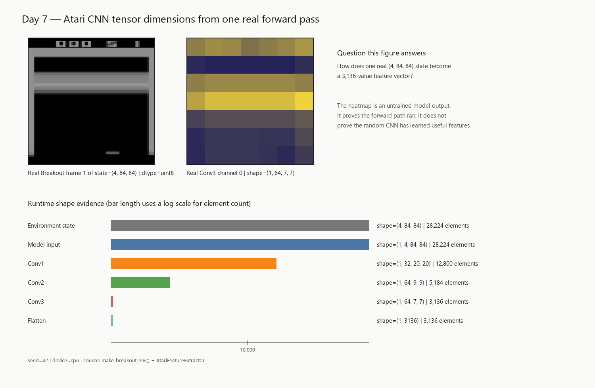

# Day 7｜`(4, 84, 84)` 進入 CNN 之後，究竟變成了什麼？

Day 6 留下一個很具體的問題：Breakout 的 state 太複雜，已經不可能像小型 toy environment 一樣，替每一種狀態準備一格 Q-table。既然接下來要讓 neural network 從畫面估計價值，第一步還不是訓練，而是先弄懂它到底會收到什麼資料。

> **四張 `84 × 84` 的灰階畫面送進 PyTorch 後，CNN 怎麼一路把它變成後續可以使用的 features？**

一個 `(4, 84, 84)` state 看起來只是三個數字，展開後其實包含：

~~~text
4 × 84 × 84 = 28,224
~~~

個 pixel values。

今天要追的，就是這 28,224 個原始數值進入模型後發生了什麼：

~~~text
(4, 84, 84) uint8
      ↓
(1, 4, 84, 84) float32，pixel / 255
      ↓
Conv1 → Conv2 → Conv3
      ↓
(1, 64, 7, 7)
      ↓
Flatten
      ↓
(1, 3136) features
~~~

至於這 3,136 個 features 最後怎麼變成 `NOOP`、`FIRE`、`RIGHT`、`LEFT` 四個 action 的 Q-values，留到 Day 8。

## 先看一次真的 forward

如果只看 `Conv2d` 的 API，很容易把 batch、channel 和畫面尺寸混在一起。所以先不背公式，直接讓專案建立 `ALE/Breakout-v5` 的預處理環境，取出一個真實 observation，再讓它跑過 CNN：

~~~powershell
python .\inspect_cnn_dimensions.py --device cpu --seed 42
~~~

這次執行得到：

~~~text
Device                  : cpu
Environment observation : (4, 84, 84) uint8, range=0..148
Model input             : (1, 4, 84, 84) torch.float32, range=0.0000..0.5804
Conv1                   : (1, 32, 20, 20)
Conv2                   : (1, 64, 9, 9)
Conv3                   : (1, 64, 7, 7)
Flatten                 : (1, 3136)
Feature dimension       : 3136
~~~

這些 shape 都來自同一次實際 forward。現在真正值得追的是：**為什麼一開始是 `(4, 84, 84)`，進 PyTorch 後多了一個 `1`，接著又變成 `32 × 20 × 20`、`64 × 9 × 9`，最後剛好剩下 3,136 個 features？**

## `(4, 84, 84)` 裡的 4 到底代表什麼？

Day 4 的 observation 不是一張 RGB 圖片，而是最近四張連續的灰階畫面。只看單張圖片，我們知道球在哪裡，卻很難知道它正往左還是往右；把連續畫面一起放進 state，Agent 才有機會從位置變化推測運動方向。這就是 frame stacking。

所以 `(4, 84, 84)` 的三個維度分別是：

~~~text
(4, 84, 84)
 ^   ^   ^
 |   |   └─ width：畫面寬度
 |   └──── height：畫面高度
 └──────── channels：四張 stacked frames
~~~

這個 `4` 是 channel，不是 batch size。

PyTorch 的 `Conv2d` 預期輸入順序是 `NCHW`：

~~~text
N = batch size：一次處理幾個 state
C = channels：每個 state 有幾個輸入平面
H = height
W = width
~~~

環境現在只給一個 state，所以還缺最前面的 batch dimension。補上 `N=1` 後才會變成：

~~~text
environment state : (4, 84, 84)
model input       : (1, 4, 84, 84)
~~~

這裡多出來的 `1` 不會憑空增加 pixel。`1 × 4 × 84 × 84` 仍然是 28,224 個數值，只是 PyTorch 現在知道「這是一批資料，而且這批目前只有一個 state」。

如果一次拿 32 個 state 訓練，才會變成 `(32, 4, 84, 84)`。同樣地，常見於其他影像函式庫的 `(84, 84, 4)` 也不能直接丟進這個 `Conv2d`，因為 channel 放在最後，而 PyTorch 這裡期待的是 NCHW。

## 28,224 個 pixel，為什麼要交給 CNN？

如果粗暴地把 28,224 個 pixel 全部攤平，再直接接一個 fully connected layer，模型完全不知道哪些 pixel 原本彼此相鄰。假設第一層只是接到 512 個 neurons，就已經需要大約：

~~~text
28,224 × 512 = 14,450,688
~~~

個 weights，還沒算 bias。

但 Breakout 畫面其實有很強的空間結構：球、球拍、磚塊都由附近的 pixel 組成，同樣的局部形狀也可能出現在畫面不同位置。CNN 正好利用這件事。它不是讓每個 pixel 和所有位置各自建立連線，而是讓一個小窗口在畫面上重複掃描，重複使用同一組 weights。

這個小窗口叫 **kernel**，每次往旁邊移動多少 pixel 叫 **stride**。例如 `kernel_size=8, stride=4`，可以先把它想成「一次看 `8 × 8` 的區域，看完後往旁邊移 4 格」。

在已經訓練好的 CNN 裡，較前面的 convolution layers 常會形成對局部亮暗、邊緣等模式有反應的 filters，後面的 layers 則有機會把局部訊號組合成更複雜的 features。不過 Day 7 的模型現在還沒有訓練，所以今天先只討論它**怎麼改變資料與 shape**，不替任何 feature map 賦予「這就是球」或「這就是球拍」之類的語意。

## 為什麼進 CNN 前還要 `/255`？

環境目前回傳的是 `uint8`，pixel 值介於 `0..255`。`Conv2d` 並不是完全不能處理 0 到 255 這個尺度，但 neural network 通常會先把影像轉成 `float32`，再除以 255，把輸入縮放到 `0..1`。這樣不同輸入的數值尺度比較一致，也比較適合後續的數值運算與最佳化。

那為什麼不乾脆讓環境一開始就永遠保存 `float32`？

因為之後的 replay buffer 會保存大量畫面。`uint8` 每個 pixel 只需要 1 byte，`float32` 通常需要 4 bytes；同樣一份影像資料，如果長期用 `float32` 保存，單是 pixel storage 就會放大約四倍。

因此專案把「儲存」和「進模型計算」分開：平常保留省空間的 `uint8`，真正要 forward 前再轉成 `float32 / 255`。

實際入口在 `observation_to_tensor()`：

~~~python
_validate_observation(observation)
resolved_device = _resolve_device(device)

contiguous_observation = np.ascontiguousarray(observation)
tensor = torch.from_numpy(contiguous_observation).to(
    device=resolved_device,
    dtype=torch.float32,
)
tensor = tensor.div(255.0)

if observation.ndim == 3 and add_batch_dim:
    tensor = tensor.unsqueeze(0)
~~~

所以單一 state 會從：

~~~text
(4, 84, 84) uint8, 0..255
~~~

變成：

~~~text
(1, 4, 84, 84) float32, 0..1
~~~

如果輸入本來就已經是一批 `(B, 4, 84, 84)`，則不會再多包一層 batch dimension。

## CNN 三層到底做了什麼？

Day 7 使用的是經典 Atari DQN 的 convolutional trunk：

~~~python
self.features = nn.Sequential(
    nn.Conv2d(input_channels, 32, kernel_size=8, stride=4),
    nn.ReLU(),
    nn.Conv2d(32, 64, kernel_size=4, stride=2),
    nn.ReLU(),
    nn.Conv2d(64, 64, kernel_size=3, stride=1),
    nn.ReLU(),
)
~~~

第一層的 `input_channels=4`，原因現在已經很清楚：輸入是四張 stacked grayscale frames，而不是一張 RGB 圖片的三個 color channels。

另一件很容易混淆的事情是，`32 → 64 → 64` **不是卷積公式算出來的**。這些數字是架構設計者選擇的 output channels，代表每一層要產生多少張 feature maps。相反地，接下來會看到的 `84 → 20 → 9 → 7`，才是由 kernel、stride、padding 等設定推導出來的空間尺寸。

每個 convolution 後面還接了一個 `ReLU`。它會把負值變成 0、正值保留，替網路加入非線性；如果中間完全沒有這類非線性，多層線性運算疊起來仍然可以等價成一次線性變換，網路能表達的關係就會受限。

## 20、9、7 是怎麼算出來的？

現在 kernel 和 stride 都有直覺了，再來看公式就比較不會只是背符號。對單一高度或寬度，卷積輸出尺寸可以寫成：

~~~text
out = floor((in + 2p - d × (k - 1) - 1) / stride + 1)
~~~

其中 `in` 是輸入尺寸、`k` 是 kernel size、`p` 是 padding、`d` 是 dilation。這個 baseline 沒有 padding，dilation 是 1，因此三層可以直接算成：

~~~text
Conv1: floor((84 - 8) / 4 + 1) = 20
Conv2: floor((20 - 4) / 2 + 1) = 9
Conv3: floor((9 - 3) / 1 + 1) = 7
~~~

於是 tensor shape 依序變成：

~~~text
Model input : (1, 4, 84, 84)
Conv1       : (1, 32, 20, 20)
Conv2       : (1, 64, 9, 9)
Conv3       : (1, 64, 7, 7)
~~~

這裡其實同時有兩條不同的變化：

~~~text
空間尺寸：84 → 20 → 9 → 7
          ↑ kernel / stride 決定

channels： 4 → 32 → 64 → 64
          ↑ 架構設計決定
~~~

把這兩件事拆開看，就不會誤以為 `32`、`64` 也是從 `84` 用某個公式算出來的。

## Flatten 後的 3,136 是什麼？

第三層卷積的輸出是 `(1, 64, 7, 7)`。先忽略最前面的 batch dimension，每一個 state 目前有：

~~~text
64 × 7 × 7 = 3,136
~~~

個 activation values。

`Flatten` 沒有再做卷積，也沒有創造新的 feature。它只是把原本的三個非 batch 維度攤平成一列：

~~~text
(1, 64, 7, 7) → (1, 3,136)
~~~

所以 Conv3 和 Flatten 的元素數量完全相同。

如果把整條路徑的元素數量放在一起看，會更直觀：

~~~text
Model input : 1 × 4  × 84 × 84 = 28,224
Conv1       : 1 × 32 × 20 × 20 = 12,800
Conv2       : 1 × 64 × 9  × 9  =  5,184
Conv3       : 1 × 64 × 7  × 7  =  3,136
Flatten     : 1 × 3,136         =  3,136
~~~

這裡可以說 tensor 的元素數量一路減少，但不要把它理解成單純把圖片「縮小」。卷積同時在重新計算 activations，channel 的意義也已經從四張原始 frame 變成 64 張由 convolution filters 產生的 feature maps。

而且這個 `3,136` 還不是 Q-value。它只是 CNN 提取出的 feature vector，真正代表四個 action 價值的輸出層要到 Day 8 才會出現。

程式也沒有把 `3136` 當成永遠不變的 magic number 寫死。`AtariFeatureExtractor` 初始化時會讓 dummy tensor 真正跑過 convolutional trunk，再從結果推導 `feature_dim`。如果未來改了輸入尺寸或 convolution 設定，feature dimension 也會跟著實際結果改變。

## 把整條變化畫出來，會發現什麼？

只看 `(1, 32, 20, 20)`、`(1, 64, 9, 9)` 這些數字還是有點抽象，所以這次也把同一次真實 forward 畫了出來：

~~~powershell
python .\visualize_cnn_dimensions.py --device cpu --seed 42
~~~

圖左上角是 environment 真正回傳的灰階 Breakout frame。它提醒我們，前面討論的 `(4, 84, 84)` 並不是一組為了講解而手工捏造的 shape，而是真正送進模型的遊戲畫面資料。

右上角則取出 Conv3 的其中一個 `7 × 7` feature map。和原本的 `84 × 84` frame 相比，可以很直接地看到空間解析度已經小很多；但現在一個 state 不再只有四張 stacked frames，而是有 64 個 convolution channels。因為模型還沒有訓練，所以這張 heatmap 只能用來觀察「中間 activation 確實被產生」，不能說某個亮點就是球、球拍或磚塊。

圖下方把每一階段的元素數量放在一起。`Environment state` 到 `Model input` 只是多一個 batch dimension，所以數量仍然是 28,224；接著 Conv1、Conv2、Conv3 分別變成 12,800、5,184、3,136；最後 Flatten 仍然是 3,136。這正好把前面手算的 shape 和實際 forward 串在一起。

圖片是由實際 observation 和 model forward 產生，不是把數字手工畫進圖裡。需要重現時，可以使用上面的命令；同一次執行的 seed、device、pixel 範圍與 runtime shapes 也保存在 [`cnn-dimensions.json`](../assets/day07/cnn-dimensions.json)。

## 如果把模型搬到 GPU，還要注意什麼？

CPU 和 CUDA 在今天其實只需要記住一條規則：**model parameters 和 input tensor 必須在同一個 device。**

例如模型已經放到 CUDA，但 observation tensor 還留在 CPU，就不能直接做 forward。反過來也一樣。因此 `observation_to_tensor()` 會接受 device，而 inspection script 也能選擇 `auto`、`cpu` 或 `cuda`；如果明確要求 CUDA，但目前環境沒有可用 CUDA，程式會直接報錯，而不是偷偷改成 CPU。

Day 7 不需要在這裡比較 CPU 和 GPU 誰比較快。現在真正重要的是：同一份 `(1, 4, 84, 84)` tensor，不論放在哪個 device，shape 的意義都不會改變。

## 3,136 個 features 之後呢？

走到這裡，`(4, 84, 84)` 已經不再只是一串需要死背的 shape。

四張連續灰階 frame 先成為四個 input channels；補上 batch dimension 後，單一 state 變成 `(1, 4, 84, 84)`；pixel 在進模型前從 `uint8` 轉成 `float32 / 255`；三層 convolution 一邊縮小空間尺寸、一邊產生更多 feature channels；最後 `64 × 7 × 7` 被 Flatten 成長度 3,136 的 feature vector。

現在 CNN 已經回答了「怎麼從 Atari 畫面得到 features」，但它還沒有回答最重要的強化學習問題：**現在按哪個 action 比較好？**

下一步就是把這 3,136 個 features 接到 fully connected layers，最後輸出：

~~~text
Q(NOOP)
Q(FIRE)
Q(RIGHT)
Q(LEFT)
~~~

到了那一步，這個 feature extractor 才會真正變成一個能估計 `Q(s, a)` 的 DQN network。

下一篇：[Day 8 — DQN 為什麼不直接告訴 Agent「往左」或「往右」？](day08-dqn-network.md)
