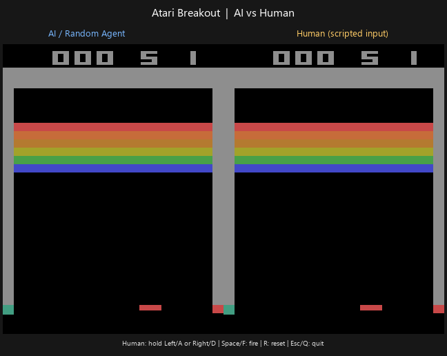

# Day 2 — Atari Breakout、ALE 與 Gymnasium

本日的目標是確認 Agent 如何透過 Gymnasium 操作 Atari Breakout，並看見環境實際提供的 observation 與 action。這一日先不進入 DQN 訓練；我們使用最簡單的 random agent 建立可執行的 baseline。

## 1. Atari Breakout 是什麼？

Breakout 是 Atari 遊戲：玩家控制底部的球拍，讓球反彈並擊破上方磚塊。對強化學習而言，遊戲提供一個持續變化的狀態，Agent 每一步選擇一個 action，然後收到新的畫面與 reward。

本專案使用標準化的 `ALE/Breakout-v5` 環境，而不是自行實作一個 Breakout clone。這讓環境介面與其他 Atari 強化學習實驗保持一致。

### 先回答：Breakout 是 Atari 出的嗎？

是。這裡的 Breakout 指的是 **Atari 在 1976 年推出的經典街機遊戲**；它不是我們自己做的 clone。`ALE/Breakout-v5` 則是把這個 Atari 遊戲放進 Atari Learning Environment，並透過 Gymnasium API 提供給程式控制。

### Atari 的簡短歷史

Atari 在 1972 年成立，早期透過 Pong 讓街機遊戲走進大眾視野；接著持續推出街機遊戲，並在 1977 年推出 Atari VCS（後來常稱為 Atari 2600），把遊戲帶進家庭。這段早期歷史可參考 [Atari 官方簡介](https://atari.com/pages/about)、[The Strong Museum 的 Pong 介紹](https://www.museumofplay.org/games/pong/) 與 [Science Museum 的電子遊戲時間線](https://blog.scienceandmediamuseum.org.uk/60-years-history-of-videogames-timeline-1951-2011/)。

Breakout 正好出現在這段街機發展的早期階段：玩家控制一個水平球拍，讓球反彈並打掉磚塊。規則看似簡單，卻很適合用來觀察 Agent 如何從畫面、動作與 reward 的互動中逐步學習；[Atari 的資料也將 Breakout 標示為 1976 年的 Atari 街機遊戲](https://atari.com/pages/among-the-top-five-highest-grossing-arcade-video-games-of-1976)。

可以把三個名稱分開理解：

- **Atari**：最初開發與發行 Breakout 的遊戲公司及品牌。
- **Breakout**：Atari 的原始街機遊戲。
- **`ALE/Breakout-v5`**：以 Atari Breakout 為基礎，透過 Atari Learning Environment 與 Gymnasium API 提供的可程式化環境。

所以我們不是在 Python 裡重新創造 Breakout，而是在控制一個標準化的 Atari 遊戲模擬環境。

## 2. ALE（Arcade Learning Environment）

ALE 是 Atari Learning Environment，負責把 Atari 遊戲模擬器包裝成可以被程式控制的環境。它處理遊戲規則、畫面更新、分數與 Atari 原生 action。

在本專案中，ALE 是 Breakout 的遊戲執行層；Agent 不直接操作模擬器內部，而是透過上層的 Gymnasium API 與它互動。

## 3. Gymnasium

Gymnasium 提供一套一致的 environment API。不同遊戲可以有不同的規則，但 Agent 可以用相同的方式呼叫：

- `env.reset()`：開始或重新開始一個 episode。
- `env.step(action)`：執行一個 action，取得環境回傳的結果。
- `env.observation_space`：描述 observation 的格式與範圍。
- `env.action_space`：描述 Agent 可以採取的 action。

## 4. Gymnasium、ALE、Breakout 與 Agent 的關係

```text
Agent
  │
  │ action
  ▼
Gymnasium
  │
  ▼
ALE / Breakout
  │
  ├─ observation
  ├─ reward
  ├─ terminated
  ├─ truncated
  └─ info
  │
  ▼
Agent
```

可以把 Gymnasium 想成統一的插座介面，把 Agent 與實際執行遊戲的 ALE 分開。Agent 只需要理解 Gymnasium 的呼叫方式；ALE 則負責讓 Breakout 按照遊戲規則前進。

## 5. `observation_space`

`observation_space` 描述 Agent 看到的 observation 可能長什麼樣子。這個專案目前使用原始 RGB 畫面，因此可以看到類似以下的空間：

```text
Box(0, 255, (210, 160, 3), uint8)
```

它代表：

- 畫面高度是 210 pixels。
- 畫面寬度是 160 pixels。
- 每個 pixel 有 3 個通道（RGB）。
- 每個值是 `uint8`，範圍是 0 到 255。

實際 reset 後的 `observation.shape` 是 `(210, 160, 3)`。

## 6. `action_space`

`action_space` 描述 Agent 可以傳給 `env.step(action)` 的 action。Breakout 的 action space 是：

```text
Discrete(4)
```

目前可用的 action meanings 是：

```text
['NOOP', 'FIRE', 'RIGHT', 'LEFT']
```

也就是 action 整數 0 到 3 分別代表不動、發射、向右與向左。程式不需要自己猜測整數的意義，可以從 `env.unwrapped.get_action_meanings()` 取得名稱。

## 7. `env.reset()`

`env.reset()` 會把環境放回 episode 的起始狀態，並回傳兩個值：

```python
observation, info = env.reset(seed=42)
```

- `observation`：episode 開始時 Agent 看到的第一個畫面。
- `info`：額外的環境資訊字典。它不是 Agent 主要要學習的 observation，但可以提供除錯或記錄用的資訊。

在本次示範中使用 `seed=42`，讓起始狀態的隨機性可以被重現。

## 8. `env.step(action)`

Agent 選好 action 後，將它傳給環境：

```python
observation, reward, terminated, truncated, info = env.step(action)
```

一次 `step` 的五個回傳值如下：

| 回傳值 | 意義 |
|---|---|
| `observation` | 執行 action 後，Agent 看到的下一個畫面。 |
| `reward` | 這一步得到的分數訊號；在 Breakout 中通常會在擊破磚塊時得到正 reward。 |
| `terminated` | episode 因遊戲本身的終止條件結束，例如遊戲結束。 |
| `truncated` | episode 因外部限制被截斷，例如時間上限到達。 |
| `info` | 額外的診斷或環境資訊。 |

如果 `terminated` 或 `truncated` 任一個是 `True`，就不應再對已結束的 episode 呼叫下一次 `step`；程式會先呼叫 `reset()` 開始新的 episode。

## 9. 程式碼快速導讀

把前面的概念放回 `play_breakout.py`，核心互動流程其實很短。現在程式同時建立兩個獨立的 Breakout environment：

```python
def main() -> None:
    ai_env = gym.make("ALE/Breakout-v5", render_mode="rgb_array")
    human_env = gym.make("ALE/Breakout-v5", render_mode="rgb_array")

    try:
        play_side_by_side(ai_env, human_env)
    finally:
        ai_env.close()
        human_env.close()

def update() -> None:
    ai_action = ai_env.action_space.sample()
    human_action = human_input.next_action()

    ai_observation, ai_reward, ai_terminated, ai_truncated, _ = ai_env.step(ai_action)
    human_observation, human_reward, human_terminated, human_truncated, _ = human_env.step(human_action)
```

可以按照這個順序閱讀：

1. `gym.make(...)` 建立兩個 `ALE/Breakout-v5`；`render_mode="rgb_array"` 讓程式取得畫面 frame。
2. 左邊的 `ai_env` 用 `action_space.sample()` 隨機選 action，代表目前尚未訓練的 AI。
3. 右邊的 `human_env` 由 `HumanInput.next_action()` 讀取鍵盤狀態。
4. 兩個 environment 各自呼叫 `step(action)`，因此左、右兩局互不影響。
5. Tkinter 把兩張 RGB frame 放在同一個視窗中，左邊顯示 AI，右邊顯示人類。
6. `terminated or truncated` 表示該局結束，程式會只重設對應的 environment。
7. `finally` 確保程式停止時呼叫兩個 `env.close()`，釋放環境資源。

## 10. AI 與人類並排操作

執行 `play_breakout.py` 後，視窗左側是 AI、右側是人類。這裡的 AI 仍然是 random agent，還不是訓練完成的 DQN；這個版本的重點是先讓兩種控制方式同時跑起來。

人類玩家可以使用以下按鍵：

- `←` 或 `A`：按住讓球拍向左。
- `→` 或 `D`：按住讓球拍向右。
- `Space` 或 `F`：按一下送出一次 `FIRE` action，發射球。
- `R`：重設右側的人類遊戲。
- `Esc` 或 `Q`：關閉視窗。

底部操作提示是固定文字，不會隨著每一個 action 和 reward 逐幀更新，避免畫面持續閃動。

## 11. 實際畫面：AI 與人類並排 GIF

下面的 GIF 是從兩個相同的 `ALE/Breakout-v5` environment 擷取的實際 RGB frames，左邊是 random agent，右邊是 scripted human input。`play_breakout.py` 也使用 `render_mode="rgb_array"`，再由 Tkinter 把兩張畫面合併到同一個視窗；實際執行時，右側可以改由鍵盤操作。



這不是訓練好的 Agent，也不是人類實際按鍵錄製的比賽，而是用 scripted input 做出的可重現示範。它的用途是先確認：左右兩個環境都在更新、兩種控制方式都真的有送出 action，而不是展示學習成果。

## 12. Random Agent 的用途

目前的 Agent 不會學習，而是從 action space 隨機抽一個 action：

```python
action = env.action_space.sample()
```

這個 baseline 的目的不是取得高分，而是先驗證完整互動管線：

```text
Agent 選擇 action
      ↓
env.step(action)
      ↓
Breakout 更新遊戲狀態
      ↓
observation + reward + episode status
      ↓
Agent 繼續下一步
```

後續加入 DQN 時，就可以用學習到的 policy 與這個完全不學習的 baseline 比較。

## 13. 本次實際驗證結果

`play_breakout.py` 在 `env.reset()` 後會輸出環境介面資訊。使用目前的 `ALE/Breakout-v5` 設定，輸出為：

```text
Observation shape: (210, 160, 3)
Observation space: Box(0, 255, (210, 160, 3), uint8)
Action space: Discrete(4)
Action meanings: ['NOOP', 'FIRE', 'RIGHT', 'LEFT']
```

程式使用兩個 `render_mode="rgb_array"` 的 environment，左側使用 random policy，右側使用鍵盤 action，並在各自的 `terminated or truncated` 時重設對應 episode。`finally` 區塊會呼叫兩個 `env.close()`，確保程式結束時釋放環境資源。

## 本日範圍

本日只驗證原始 Atari environment 的基本介面與互動流程。84×84 resize、grayscale、frame stacking、Replay Buffer 與 DQN 會在後續階段處理，並不屬於本日的實作。
