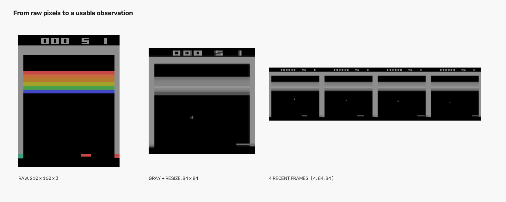
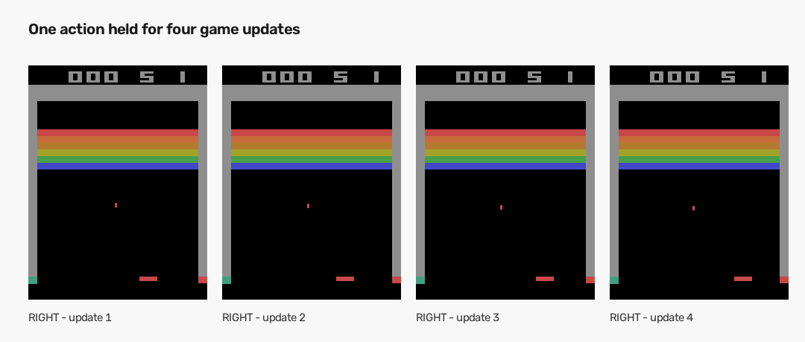
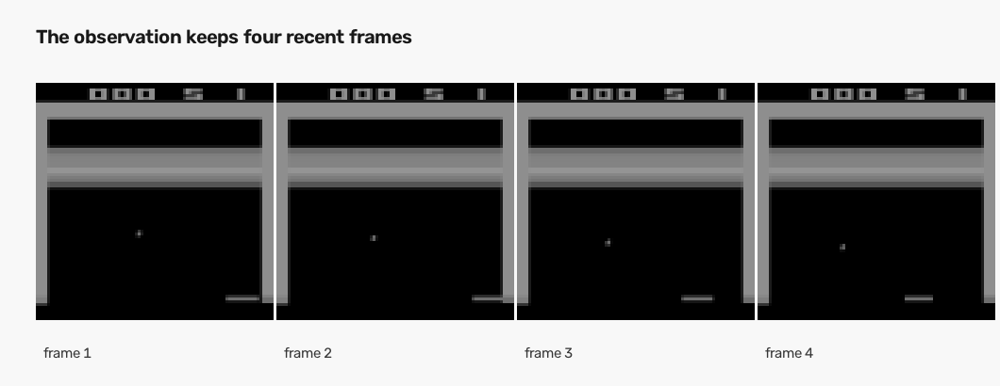

# Day 4｜AI 看到的，不再只是一張畫面

Day 3 的時候，我們讓 AI 和 Breakout 互動，並拆開了一次遊戲回傳的資料。

當時 AI 每次拿到的是一張原始遊戲畫面：

```text
210 × 160 × 3
```

可以把它想成一張寬 160、高 210 的彩色圖片，最後的 3 代表紅、綠、藍三種顏色。

這張圖片看起來已經包含很多資訊，但它其實還不適合直接拿來學習。

問題在於：

> 只看一張畫面，AI 知道球現在在哪裡，卻不一定知道球正在往哪裡飛。

今天要做的事情，就是把原始畫面整理成 AI 比較容易使用的形式。

## 先把畫面變小、變簡單

對 Breakout 來說，AI 最需要知道的是：

- 球在哪裡；
- 球拍在哪裡；
- 磚塊在哪裡；
- 這些東西正在怎麼移動。

畫面的顏色不一定是最重要的資訊。因此第一步，我們把彩色畫面轉成灰階。

灰階畫面不再分成紅、綠、藍三種顏色，而是用一個數字表示明暗。這樣一張畫面就不需要同時保存三份顏色資料。

接著，再把畫面縮小成：

```text
84 × 84
```

這不代表我們把遊戲內容刪掉了，而是把太大的圖片縮小，保留球、球拍和磚塊之間的相對位置，同時減少後面計算的負擔。

所以，第一階段的結果是：

```text
原始彩色畫面
(210, 160, 3)
        ↓
灰階 + 縮小
        ↓
(84, 84)
```

這個「先整理畫面再交給 AI」的步驟，通常叫做畫面預處理（preprocessing）。



*從左到右：原始畫面、整理後的單張畫面，以及最後交給 AI 的四張畫面。*

## AI 不需要每一個小動作都重新決定

遊戲畫面其實更新得很快。如果 AI 每更新一次畫面，就必須重新選一次動作，會做出非常多決定，而且很多決定之間的差異很小。

因此我們讓同一個動作持續一小段時間。

例如 AI 選擇向右：

```text
AI 選擇「向右」
        ↓
遊戲連續更新 4 次
        ↓
AI 再選下一個動作
```

這叫做 frame skip。它真正代表的是：

> 同一個動作要持續多久，AI 多久重新做一次決定。

在我們的設定裡，這個數字是 4。



*同一個動作持續四次遊戲更新，AI 再重新選擇下一個動作。*

有一個容易忽略的地方：遊戲本身也可能自動跳過畫面。因此我們先把遊戲本身的跳過次數設成 1，再由畫面處理步驟統一負責「持續 4 次」。

如果兩邊都跳過，就會重複計算，AI 以為自己走了一小步，遊戲卻可能已經向前走了太多步。

## 為什麼還要保留最近幾張畫面？

現在每次得到的畫面雖然比較小，但仍然只有一張。

假設球出現在同一個位置：

```text
畫面 A：球正在往右下方移動
畫面 B：球正在往左上方移動
```

如果只看當下那一張，AI 很難分辨這兩種情況。

人類通常不會只看一張截圖。我們會看前後幾個畫面，從位置的變化判斷球的方向。

所以 Day 4 會保留最近四張灰階畫面：

```text
第 1 張畫面
第 2 張畫面
第 3 張畫面
第 4 張畫面
        ↓
放在一起交給 AI
```

這個做法叫做 frame stacking，也就是把連續畫面疊在一起。

最後的資料形狀是：

```text
(4, 84, 84)
```



*這四張連續畫面放在一起，讓 AI 能從位置變化推測球的移動方向。*

其中：

- 第一個 4 代表四個不同時間點的畫面；
- 84 代表畫面高度；
- 84 代表畫面寬度。

這裡的 4 不是四種顏色，而是四段短時間記錄。

也要注意兩個「4」的差別：

```text
frame skip = 4
  同一個動作持續 4 次遊戲更新

frame stacking = 4
  一次保留最近 4 張畫面
```

它們剛好使用同一個數字，但解決的是完全不同的問題。

## 遊戲剛開始時，還沒有四張畫面怎麼辦？

一局遊戲剛開始時，我們手上只有第一張畫面，還沒有過去的三張畫面。

這時會用第一張畫面填滿整個畫面組合：

```text
剛開始：
[第一張、第一張、第一張、第一張]

下一次：
[第一張、第一張、第一張、第二張]

再下一次：
[第一張、第一張、第二張、第三張]
```

這樣每一次交給 AI 的資料大小都相同，也不會把上一局最後的畫面帶到下一局。

## 為什麼不現在就把數字變成小數？

目前每個像素仍然使用 `0` 到 `255` 的小整數表示。程式裡把這種資料稱為 `uint8`，但可以先把它理解成「很省空間的像素數字」。

如果一開始就把所有畫面轉成小數，每個數字會需要更多記憶體。之後我們會保存大量遊戲畫面，讓 AI 從過去的經驗中學習；這時記憶體大小就會變得很重要。

因此目前先保存小整數。等到真正送進模型之前，再把它轉成小數並縮放到 `0` 到 `1` 之間。

這樣可以同時得到兩個好處：

- 保存大量畫面時比較省記憶體；
- 模型計算時仍然可以使用適合計算的小數。

## 實際執行後看到了什麼？

用固定的隨機起點執行 8 步後，可以看到三個階段的結果：

```text
原始畫面
  shape : (210, 160, 3)
  dtype : uint8

整理後的單張畫面
  shape : (84, 84)
  dtype : uint8

最後交給 AI 的畫面
  shape : (4, 84, 84)
  dtype : uint8
```

每次遊戲更新時，AI 仍然使用原本的四個動作：不動、發射、向右、向左。今天改變的是 AI 看到的畫面格式，沒有改變遊戲本身可以做的事情。

## Day 4 做完了什麼？

Day 4 完成了一條完整的畫面整理流程：

```text
原始彩色畫面
(210, 160, 3)
        ↓
灰階、縮小
(84, 84)
        ↓
同一個動作持續 4 次遊戲更新
        ↓
保留最近 4 張畫面
(4, 84, 84)
```

這讓 AI 不只看見「球現在在哪裡」，也有機會從幾張連續畫面的差異中，理解球正在往哪裡移動。

今天我們解決的是「AI 要看什麼」。

下一個問題則是：

> AI 已經看得到比較完整的遊戲狀態，那它要怎麼判斷哪個動作對未來最好？

這就是下一篇要開始討論的問題。
