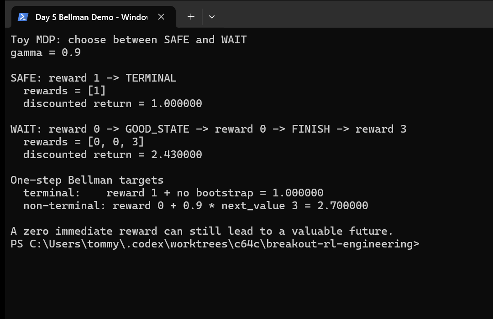

# Day 5｜一步沒有得分，為什麼仍可能是好選擇？

Day 4 讓 Agent 同時看到 Breakout 最近四張畫面。這四張 `84 × 84` 的灰階畫面組成 `(4, 84, 84) / uint8` 的輸入，也就是 Agent 用來描述「現在情況」的狀態表示（state representation）。這讓 Agent 不只知道球現在在哪裡，也能從位置變化猜測球往哪裡移動。

但「看得到」只解決了一半的問題。

假設 Agent 在某個畫面按下 `RIGHT`，遊戲立刻回傳的 reward 是 `0`。這個動作是好還是不好？它可能什麼都沒有做到，也可能讓球拍移到正確位置，下一刻接住球。只看這一步的分數，無法分辨這兩種情況。

今天要回答的問題是：**一個動作的價值，為什麼不能只看現在，而要把未來一起算進來？**

## 先看選擇造成的路徑

先不急著記公式。把 Agent 的選擇簡化成一個可以手算的小遊戲：

```text
START
 ├─ SAFE → reward 1 → TERMINAL
 └─ WAIT → reward 0 → GOOD_STATE
                    └─ WAIT → reward 0 → FINISH
                              └─ FINISH → reward 3 → TERMINAL
```

SAFE 立刻拿到 `1`，WAIT 一開始拿到的是 `0`。如果只看第一步，SAFE 看起來比較好；但 WAIT 會通往最後的 `3`。這裡真正重要的不是哪條路一定獲勝，而是：**一個選擇會改變接下來還能發生什麼事。**

因此，我們需要的不是「這一步拿幾分」而是「從現在開始，這條路最後能帶來多少回報」。這個從現在往後累積的數字，叫做 return。

## Return：把未來的 reward 累積起來

reward 是環境在這一步立刻回傳的回饋；return 則是從現在開始，把後面每一步的 reward 都算進來。未來的分數通常不會和現在的分數同等重要，所以會先乘上一個折扣係數 `gamma`：

```text
G_t = r_(t+1) + gamma × r_(t+2) + gamma² × r_(t+3) + ...
```

沿用上面的 WAIT 路徑，假設接下來收到的 rewards 是 `[0, 0, 3]`，`gamma = 0.9`：

```text
G_t = 0 + 0.9 × 0 + 0.9² × 3
    = 2.43
```

WAIT 的 immediate reward 是 `0`，但它的 return 是 `2.43`；SAFE 的 return 是 `1`。所以「現在沒有得分」和「這個動作沒有價值」是兩件不同的事。

### `gamma` 是時間範圍的選擇

`gamma` 的範圍是 `0 <= gamma <= 1`。它不是環境回傳的數字，而是我們對未來的取捨：

- `gamma = 0`：只看下一個 reward，完全不在乎更後面的結果；
- `gamma = 0.9`：兩步之後的 reward 只保留 `0.9²` 的權重；
- `gamma` 接近 `1`：較遠的未來仍然會明顯影響現在的選擇。

`gamma` 越小，Agent 越像只在乎眼前；`gamma` 越接近 `1`，Agent 越願意為了長期回報等待。它不是越大越好，而是決定這個決策問題要看多遠。

## MDP：把互動問題的角色說清楚

剛才的小型決策遊戲（toy game）已經包含強化學習最重要的互動：Agent 看見目前情況，選一個動作，環境產生回饋和下一個情況。把這種互動寫成正式的數學框架，叫做 **Markov Decision Process（MDP，馬可夫決策過程）**。

把它放回 Breakout，可以得到下面的對照：

| 記號 | 它描述什麼 | Breakout 中的對應 |
| --- | --- | --- |
| `S` | Agent 可能看見的狀態 | Day 4 的四張連續畫面，也就是目前使用的 state representation |
| `A` | Agent 可以做的選擇 | `NOOP`、`FIRE`、`RIGHT`、`LEFT` |
| `P` | 動作如何造成下一個狀態 | 執行 action 後，遊戲如何從 `s` 轉移到 `s'`，可寫成 `P(s'\|s,a)` |
| `R` | 環境給的回饋 | Breakout 環境在這一步回傳的 reward |
| `gamma` | 未來回饋的折扣 | Agent 要把未來看得多重要 |

`P` 不是一張單純的「下一張圖片對照表」。它描述 action 如何影響下一個狀態和 reward。真正的 Breakout 有太多可能的畫面與遊戲內部狀態，Agent 不需要先把完整的轉移規則列出來，仍然可以透過互動資料學習。這種不先建立完整環境模型的方向，就是 Day 6 要開始接上的 model-free Q-Learning。

嚴格來說，`gamma` 是價值計算的折扣設定，不是環境在每一步直接回傳的欄位；但它和 `S`、`A`、`P`、`R` 一起決定了 Agent 正在解的長期決策問題，因此在這篇一起看。

## 四張畫面是不是完整的 state？

MDP 有一個重要的假設：如果目前的 state 已經包含做下一步決策所需的資訊，那麼知道現在的 state 和 action 後，就不必再翻查更久以前的完整歷史。這個條件叫做 **Markov property**。

單張 Breakout 畫面只告訴我們球的位置，不一定告訴我們球正在往哪裡飛。Day 4 把最近四張畫面疊在一起，讓 Agent 可以從位置變化推測短期速度和方向，所以這個輸入比單張畫面更適合做決策。

但四張畫面只是實用的近似，不是「已經完整恢復遊戲狀態」的數學保證。它提供更多短期資訊，讓 Markov 式的假設更合理；不能因此宣稱 Breakout 已經完全滿足 Markov property。這個邊界很重要，因為 state representation 是我們提供給 Agent 的資訊，不等於遊戲內部所有資訊的完整複製品。

## `V(s)` 和 `Q(s,a)` 問的是不同問題

Return 描述一條實際路徑最後得到多少回報。當可能的未來不只一條時，我們還需要問「平均來說，從這裡開始有多好」。

如果只固定目前的 state，答案叫做 `V(s)`：

```text
V(s) = 從 state s 開始，未來 return 的期望值
```

如果連目前要做的 action 也固定，答案叫做 `Q(s,a)`：

```text
Q(s,a) = 在 state s 先做 action a 之後，未來 return 的期望值
```

這裡的「期望值」表示對可能發生的未來取平均；符號 `E` 只是把這個平均寫出來：

```text
V(s)   = E[G_t | s_t = s]
Q(s,a) = E[G_t | s_t = s, a_t = a]
```

`V(s)` 把接下來的動作交給目前的策略（policy）；`Q(s,a)` 則先問「如果現在就是做這個 action，後面可能得到多少」。因此在同一個畫面上，Agent 可以比較 `Q(s, RIGHT)` 和 `Q(s, LEFT)`，即使兩邊這一步的 reward 都是 `0`。

這就是 Q-value 和 immediate reward 的差別：reward 是環境現在給了多少，Q-value 是先做某個選擇後，整段未來平均有多好。

## Bellman Equation：不用從頭展開整條未來

Return 看起來需要把未來所有 reward 都列出來，但價值計算可以換一種問法：

```text
現在這個選擇有多好
= 這一步拿到多少
  + 折扣後的下一個狀態有多好
```

這個「現在加上折扣後的未來」關係，就是 Bellman Equation。對最佳 Q-value，可以寫成：

```text
Q*(s,a) = E[r + gamma × max_a' Q*(s',a')]
```

`Q*` 的星號表示最佳價值；`max` 表示到了下一個 state 之後，選擇估計價值最高的 action。這個式子沒有宣稱 Agent 一開始就知道 `Q*`，它只是說：**如果價值估計正確，它應該和「現在的 reward 加上未來的價值」一致。**

這也是為什麼 Bellman Equation 會成為 Day 6 的起點：下一步不是再背一條公式，而是想辦法用一次次的互動資料，讓未知的 Q-value 逐漸靠近這個關係。

## 用實際數字確認這個關係

專案中的小型 demo 會用上面的 toy MDP 計算兩種數字。執行：

```powershell
python .\bellman_demo.py --gamma 0.9
```

實際輸出的重點如下：

```text
SAFE: reward 1 -> TERMINAL
  discounted return = 1.000000

WAIT: reward 0 -> GOOD_STATE -> reward 0 -> FINISH -> reward 3
  discounted return = 2.430000

terminal:    reward 1 + no bootstrap = 1.000000
non-terminal: reward 0 + 0.9 * next_value 3 = 2.700000
```

下圖是同一條命令在 Windows PowerShell 的實際執行畫面：



*在 `gamma = 0.9` 時，WAIT 雖然從 immediate reward `0` 開始，折扣後的 return `2.43` 仍高於 SAFE 的 `1`。*

前兩個數字是完整的 return：SAFE 立刻得到 `1`，WAIT 把 `[0, 0, 3]` 折扣後得到 `2.43`。後兩個數字則是 one-step target：如果現在 reward 是 `0`，而下一個 state 的 value estimate 是 `3`，那麼 non-terminal target 就是 `0 + 0.9 × 3 = 2.7`。

這個 target 只是教學用的單步計算，還沒有開始訓練。它的作用是把 Bellman Equation 中的「現在 + 未來」變成可以手算、也可以由程式驗證的數字。

## Terminal 和 truncated 不能混成同一件事

Bellman target 有一個不能忽略的邊界：如果遊戲真的到達 terminal state，後面沒有下一段回報可以接，所以 target 只能保留目前的 reward：

```text
terminated = True
target = reward
```

如果遊戲還沒有真正結束，才把下一個 state 的 value 接回來：

```text
terminated = False
target = reward + gamma × next_value
```

這裡的「真正結束」對應 Gymnasium 的 `terminated`：遊戲本身到達終止條件。另一個欄位 `truncated` 則表示一局遊戲（episode）因為外部限制被截斷，例如時間上限。

收集資料時，`terminated` 或 `truncated` 任一為 `True`，通常都要 reset，因為這一局不能再繼續執行。但計算 target 時，不能把兩者永久合併成一個 `done`，再無條件把未來價值設成 `0`。時間到了不代表遊戲狀態本身沒有未來；如果 `truncated=True` 但 `terminated=False`，就要依照資料與訓練的設計保留 bootstrap 的可能。

把下一個 state 的 value estimate 接回目前 target，這個動作通常稱為 bootstrap。demo 的 `bellman_target()` 只使用 `terminated` 控制是否 bootstrap，因此保留了「遊戲真的結束」和「這次互動只是被外部切斷」之間的語意差異。

## 從今天接到 Day 6

今天可以把整件事濃縮成一條因果鏈：

```text
Agent 看見 state
      ↓ 選 action
環境回傳 immediate reward 和 next state
      ↓
return 把未來 reward 累積起來，gamma 決定折扣
      ↓
V(s) / Q(s,a) 描述長期價值
      ↓
Bellman Equation 把現在的 reward 接上未來的價值
```

所以，Bellman Equation 的一句話版本是：

> **一個 action 的價值，不只看現在拿到多少 reward，還要看它把我帶到的未來有多好。**

現在只剩下一個自然的問題：Q-value 一開始並不知道，Agent 要怎麼靠實際 interaction 一次次把它學準？這就是 Day 6 要回答的 Q-Learning 問題。

下一篇：Day 6 — 從 Bellman Equation 到 Q-Learning，再理解為什麼 Breakout 需要 Deep Q-Learning。
