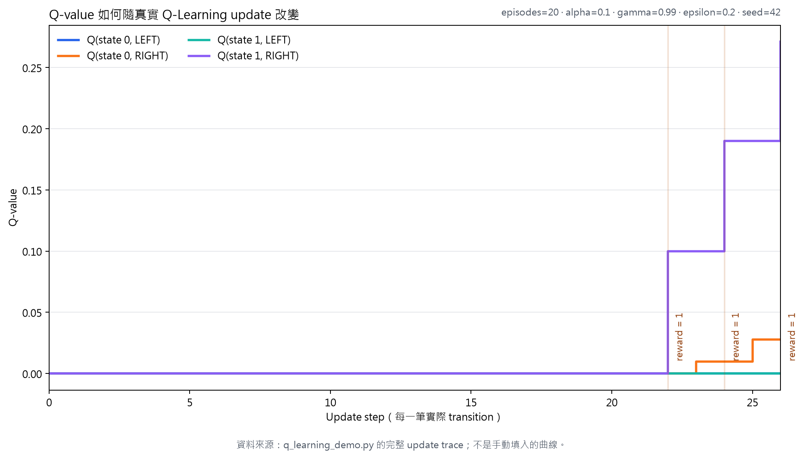
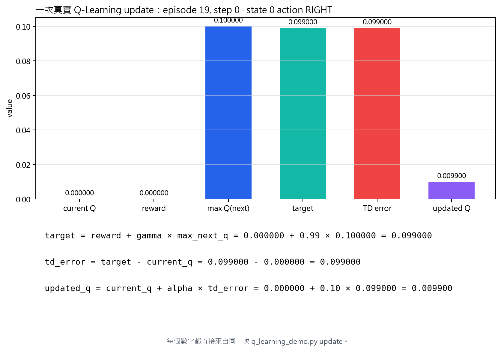

# Day 6｜Q-value 一開始不知道，Agent 怎麼把它學出來？

Day 5 已經說明一件事：一個 action 的價值，不能只看這一步拿到多少 reward，還要看它把 Agent 帶到什麼樣的未來。

但這裡還留著一個實作問題：

> Bellman Equation 說明了價值之間應該怎麼連起來，Q-value 一開始卻全部不知道。Agent 到底怎麼靠一次次 transition，把這些數字學出來？

這一天先不碰神經網路，也不直接拿 Breakout 的畫面建立巨大表格。我們先看一個可以完整追蹤的 tabular Q-Learning 執行結果，再拆開其中一次真的 update。

## 先看實際執行結果

這個 demo 的小環境只有兩個非 terminal state：

~~~text
state 0 --RIGHT / reward 0--> state 1 --RIGHT / reward 1--> TERMINAL
   |
   +--LEFT / reward 0-------> TERMINAL

state 1 --LEFT / reward 0----> TERMINAL
~~~

在 Windows PowerShell 執行 20 個 episode：

~~~powershell
python .\q_learning_demo.py --episodes 20 --seed 42
~~~

這次實際輸出的開頭和結尾如下：

~~~text
Toy MDP: tabular Q-Learning
state 0 --RIGHT / 0--> state 1 --RIGHT / 1--> TERMINAL
any LEFT action ends the episode with reward 0
episodes = 20, alpha = 0.1, gamma = 0.99, epsilon = 0.2, seed = 42

First Q-Learning updates
  episode 1, step 0: state=0 action=LEFT reward=0 next_state=TERMINAL target=0.000000 td_error=0.000000 updated_q=0.000000
  episode 2, step 0: state=0 action=RIGHT reward=0 next_state=1 target=0.000000 td_error=0.000000 updated_q=0.000000

Final Q-table
  state 0: LEFT=0.000000, RIGHT=0.027720
  state 1: LEFT=0.000000, RIGHT=0.271000

Greedy policy from the learned table
  state 0 -> RIGHT
  state 1 -> RIGHT
~~~

先不要急著看公式，光看這個結果就能發現一個重要現象：

- Q-table 一開始所有值都是 0；
- state 1 的 RIGHT 最後變成 0.271；
- state 0 的 RIGHT 當下 reward 仍然是 0，最後卻變成 0.02772；
- LEFT 沒有通往 reward 1，因此維持 0。

這回答了第一個問題：Q-Learning 學到的不是「這一步有沒有得分」，而是「這個 state-action 組合，從現在往後看有沒有比較好的結果」。

### Figure 1：Q-value 如何真的被學出來？

下圖不是手動填入的示意曲線。產圖程式先重新執行 q_learning_demo.py，保存每一次 update 的 CSV，再從同一份資料畫出四條線。

圖上可以看到：

- Q(state 0, LEFT) 和 Q(state 1, LEFT) 維持在 0；
- Agent 第一次走到 state 1 的 RIGHT 並得到 reward 1 後，Q(state 1, RIGHT) 先開始上升；
- 下一次 state 0 選 RIGHT 時，雖然 reward 仍是 0，但它看到 state 1 已經有正的價值，所以 Q(state 0, RIGHT) 也開始上升。

這就是「價值往前傳」在真實 update trace 中留下的痕跡。

## 拆開一次真正的 update

現在選取同一份 trace 裡的 episode 19、step 0：

~~~text
state       = 0
action      = RIGHT
reward      = 0
current Q   = 0.000000
max next Q  = 0.100000
gamma       = 0.99
alpha       = 0.10
~~~

這一步本身沒有 reward，但下一個 state 已經有一個 0.1 的 Q-value。把它代入更新：

~~~text
target   = reward + gamma × max_next_q
         = 0.000000 + 0.99 × 0.100000
         = 0.099000

TD error = target - current_q
         = 0.099000 - 0.000000
         = 0.099000

updated Q = current_q + alpha × TD error
          = 0.000000 + 0.10 × 0.099000
          = 0.009900
~~~

這是同一次真實 update 的數值拆解：

這張圖要回答的不是「Q-Learning 有哪些名詞」，而是：

> 為什麼這一次 Q(0, RIGHT) 會從 0 變成 0.0099？

原因很直接：現在 reward 是 0，但下一個 state 的估計已經是 0.1；gamma 把這個未來價值折扣後形成 target，alpha 再決定這次只移動多少。

## Q-Learning 的更新規則

看到實際數字之後，公式就不再只是抽象符號。

只要下一個 state 還沒有結束，target 是：

~~~text
target = r + gamma × max_a' Q(s', a')
~~~

其中：

- r：這一步環境回傳的 reward；
- gamma：未來價值保留多少；
- max Q(s', a')：下一個 state 中目前估計最好的 action 價值。

接著計算目前估計離 target 有多遠：

~~~text
TD error = target - Q(s,a)
~~~

最後只修正一部分：

~~~text
Q(s,a) = Q(s,a) + alpha × TD error
~~~

alpha 是 learning rate。它不會改變 target 是什麼，而是決定這一次 update 要靠近 target 多少：

- alpha = 1：一次移到 target；
- alpha = 0：完全不更新；
- 介於兩者之間：只移動一部分。

## 為什麼不用等整局結束？

在 episode 18，Agent 走出這筆 transition：

~~~text
state 1 --RIGHT / reward 1--> TERMINAL
~~~

這是 terminal transition。因為遊戲已經結束，後面沒有下一個 state 可以繼續估計，所以 target 只能是目前 reward：

~~~text
target = reward = 1
~~~

這次先把 Q(1, RIGHT) 從 0 更新到 0.1。

接著在 episode 19，Agent 又走出：

~~~text
state 0 --RIGHT / reward 0--> state 1
~~~

這一步沒有 reward，但 state 1 的 RIGHT 已經有 0.1。因此 target 變成：

~~~text
target = 0 + 0.99 × 0.1 = 0.099
~~~

這讓 Q(0, RIGHT) 也開始上升。

reward 1 並沒有直接出現在 state 0 → RIGHT 這一步，但它的影響透過 Q(state 1, RIGHT) 開始往前傳。這就是前面 Figure 1 中看到「後面的 Q-value 先上升，前面的 Q-value 再跟著上升」的原因。

Agent 不需要等完整局遊戲結束，才知道前面的 action 可能有價值。每一筆 transition 都可以先使用目前的估計做一次修正。這種「用目前估計的未來，幫助更新現在」叫做 bootstrap。

## Agent 怎麼有機會探索 RIGHT？

一開始所有 Q-value 都是 0。如果 Agent 永遠只選目前最大的 action，就可能固定選 LEFT，永遠走不到 reward 1 的路徑。

因此 demo 使用 epsilon-greedy：

- 大部分時間選目前 Q-value 最大的 action；
- 少部分時間隨機探索；
- epsilon = 0.2 表示保留一部分探索機會；
- Day 6 不加入 epsilon decay，完整的探索排程留到 Day 10。

固定 seed 讓這段隨機探索可以重現。這不是把隨機拿掉，而是讓同一組條件能再次產生同一份 trace。

## Q-Learning 為什麼是 off-policy？

行為時，Agent 可能因為 epsilon 探索而真的選了 LEFT；但是建立 target 時，仍然使用下一個 state 的最大 Q-value：

~~~text
max_a' Q(s', a')
~~~

簡單來說，Agent 可以一邊因為 epsilon 亂試，一邊學「如果接下來都選目前認為最好的 action，這裡的價值是多少」。

也就是：

- 實際採取的 action；
- 更新時假設下一步會採取的最佳 action；

這兩件事可以不同。因為「實際產生資料的行為」與「update 時假設的目標策略」不一定相同，所以 Q-Learning 稱為 off-policy。這篇不深入 SARSA，只保留這個對照：SARSA 會使用實際下一個 action，Q-Learning 使用下一個 state 的最大估計值。

## 為什麼 Breakout 不能直接用 Q-table？

在 toy environment 裡，state 很少，所以可以直接建立：

~~~text
Q-table[state, action]
~~~

但 Day 4 的 Breakout state 是：

~~~text
(4, 84, 84) uint8
~~~

它代表連續四張畫面。pixel 組合形成的 state 空間太大，幾乎不可能為每一種畫面各存一格 Q-value；而且 Agent 很少會兩次看到完全相同的畫面。

這裡還有另一個更根本的問題：即使兩張 Breakout 畫面非常相似，只要 pixel state 不完全相同，在 tabular Q-Learning 中仍然會被視為不同的 state，無法自然共享已經學到的經驗。

Neural Network 不只是為了省掉一張巨大的表，而是希望從大量相似 state 中學出可以共享的 representation / pattern，讓沒看過但相似的 state 也能得到合理的 Q-value 估計。

因此要保留的不是「每一張畫面的表格」，而是「從 state 估計 action 價值的能力」：

~~~text
(4, 84, 84) state pixels
          ↓
   Neural Network
          ↓
Q(NOOP), Q(FIRE), Q(RIGHT), Q(LEFT)
~~~

這就是 Deep Q-Learning / DQN 的核心轉變：

- 小型 toy problem：直接查 Q-table；
- Breakout：讓 neural network 近似原本查表的功能。

Q-Learning 的核心目標沒有消失：我們仍然希望估計 Q(s,a)，也仍然利用 reward 與下一個 state 的價值建立學習目標。差別是，小型問題可以直接修改 Q-table 中的一個數字；到了 DQN，我們會改成調整 neural network 的參數，讓 network 學會從 state 推估所有 actions 的 Q-values。

至於 DQN 真正訓練時還需要的 Day 9 Experience Replay、Day 10 Exploration、Day 11 Target Network，以及 Day 12 的 loss、optimizer 與完整 training loop，會在 Day 9～Day 12 再逐步補齊；今天先把「Q-value 是怎麼被學出來的」弄清楚。

## 實作與重建產物

這次的圖由同一個 Python command 重新產生：

~~~powershell
python .\scripts\visualize_day06.py
~~~

這個 command 會：

1. 實際執行 q_learning_demo.py；
2. 保存完整的 CSV / JSON update trace；
3. 從 trace 產生 Figure 1 learning curve；
4. 從同一份 trace 選出一筆 update，產生 Figure 2 breakdown。

原始資料也保留在：

- [q_learning_trace.csv](../assets/day06/q_learning_trace.csv)
- [q_learning_trace.json](../assets/day06/q_learning_trace.json)

所以圖片中的 episode、state、action、reward、target、TD error 和 updated Q，都可以回到同一筆 machine-readable trace 查證。

## 從今天接到 Day 7

今天真正跑過的因果鏈是：

~~~text
Q-table 全部是 0
        ↓
Agent 實際執行 transition
        ↓
某一步得到 reward 1
        ↓
Q(1, RIGHT) 先更新
        ↓
下一個 transition 使用 max next Q
        ↓
Q(0, RIGHT) 也開始上升
        ↓
Breakout 的 state 太大，Q-table 不可行
        ↓
用 neural network 近似 Q-function
~~~

現在我們知道 Q-Learning 到底在更新什麼，也能從真實數據看見價值如何逐步改變。

下一個問題是：**如果輸入變成四張 84 × 84 的 Atari 畫面，CNN 要怎麼把它轉成可以估計四個 action 價值的 features？**

這就是 Day 7 的 CNN Feature Extractor。
