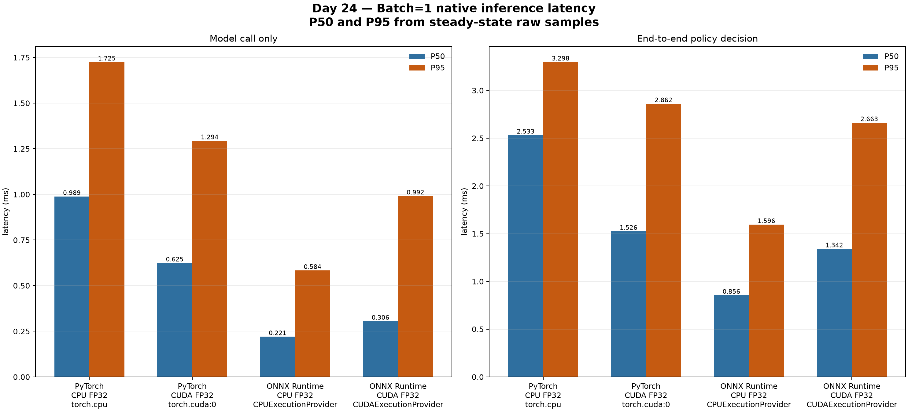
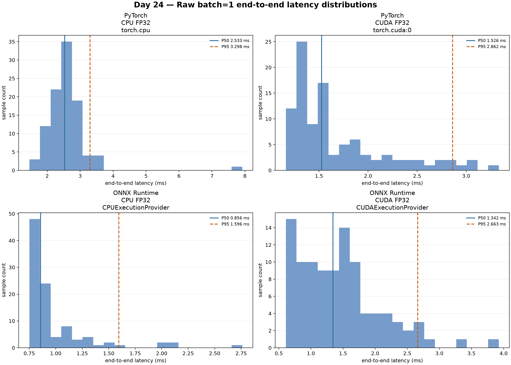

# Day 24｜一次 Batch=1 決策到底需要多久？

Day 23 已經確認同一個 Day 21 canonical Final Model 在 PyTorch 與 ONNX Runtime 之間仍能做出相同決策。接下來才有資格問速度：未來網頁右側的 RL Agent 每拿到一個 state，從輸入到 action 的時間是否可能拖慢即時 gameplay？

這份 report 只回答 native inference 的問題。它不包含 ALE `env.step()`、瀏覽器繪圖或 ONNX Runtime Web；那些是後續 Browser workload 需要重新量測的邊界。

- benchmark id: `day24-final-native-v2-20260905-rtx4060`
- generated at: `2026-09-05T06:08:12.016516Z`
- warm-up iterations: `25`
- measured iterations per result: `100`
- batch sizes: `[1, 4, 16, 32]`; primary: `1`
- model-only timing semantics: `prevalidated_runtime_call`; end-to-end timing semantics: `production_policy_decision_path`
- input fixture: `assets/day22/inference/probe_states.npz` (60 observations)

## 先看產品真正關心的 end-to-end decision

`end-to-end` 代表固定的 `uint8 (4,84,84)` observation 經過既有 inference adapter 的 normalization、tensor/provider transfer、model call、輸出取回與 `argmax`。下面的 P50 是一半樣本不超過的延遲；P95 則是把較慢的尾端也算進來，因此不能只看平均值或最快一次。

| runtime | requested | actual provider | scope | batch | threads | samples | P50 (ms) | P95 (ms) | mean (ms) | std (ms) | decisions/s |
| --- | --- | --- | --- | ---: | --- | ---: | ---: | ---: | ---: | ---: | ---: |
| PyTorch | CPU | torch.cpu | end_to_end | 1 | default | 100 | 2.533 | 3.298 | 2.600 | 0.670 | 384.661 |
| PyTorch | CUDA | torch.cuda:0 | end_to_end | 1 | default | 100 | 1.526 | 2.862 | 1.691 | 0.502 | 591.408 |
| ONNX Runtime | CPU | CPUExecutionProvider | end_to_end | 1 | default | 100 | 0.856 | 1.596 | 0.985 | 0.336 | 1015.386 |
| ONNX Runtime | CUDA | CUDAExecutionProvider | end_to_end | 1 | default | 100 | 1.342 | 2.663 | 1.445 | 0.641 | 691.984 |

圖表把同一批 raw samples 重新畫成 P50/P95 與分布；它的用途是讓讀者看到 runtime/provider 的差異，以及 tail latency 是否被平均值藏起來。

## Model-only 和 end-to-end 為什麼要分開

model-only 先在計時外準備並驗證好 `float32` model input，再只量 prevalidated runtime/model call；它回答的是神經網路與 runtime API 本身的成本。end-to-end 才包含一次右側 Agent decision 實際會付出的 input preparation、policy validation、transfer、輸出取回與 action selection。兩者不能拿不同 scope 的數字直接混成一個排行榜。

| runtime | requested | actual provider | scope | batch | threads | samples | P50 (ms) | P95 (ms) | mean (ms) | std (ms) | decisions/s |
| --- | --- | --- | --- | ---: | --- | ---: | ---: | ---: | ---: | ---: | ---: |
| PyTorch | CPU | torch.cpu | model_only | 1 | default | 100 | 0.989 | 1.725 | 1.058 | 0.323 | 945.130 |
| PyTorch | CUDA | torch.cuda:0 | model_only | 1 | default | 100 | 0.625 | 1.294 | 0.785 | 0.307 | 1274.501 |
| ONNX Runtime | CPU | CPUExecutionProvider | model_only | 1 | default | 100 | 0.221 | 0.584 | 0.307 | 0.298 | 3252.741 |
| ONNX Runtime | CUDA | CUDAExecutionProvider | model_only | 1 | default | 100 | 0.306 | 0.992 | 0.458 | 0.305 | 2184.393 |

這個界線也解釋了為什麼 GPU model-only 很快，不代表完整 decision 一定同樣快：小模型的輸入搬移、同步與輸出 materialization 可能和真正的神經網路計算一樣重要。

## 一次 decision 的時間拆解

PyTorch CUDA 的 end-to-end path 另外保留四段 timing：input preparation（包含這個 contract adapter 的 normalization 與 host→device 路徑）、runtime inference、device→host output materialization，以及 `argmax`。每一段都在必要處同步 CUDA，避免只量到非同步 kernel launch。

| runtime | provider | input prepare P50/P95 (ms) | runtime P50/P95 (ms) | output P50/P95 (ms) | argmax P50/P95 (ms) | output scope |
| --- | --- | ---: | ---: | ---: | ---: | --- |
| PyTorch | torch.cpu | 0.507/0.592 | 1.976/2.738 | 0.024/0.028 | 0.017/0.021 | separate |
| PyTorch | torch.cuda:0 | 0.365/0.725 | 1.018/2.115 | 0.049/0.108 | 0.009/0.014 | separate |
| ONNX Runtime | CPUExecutionProvider | 0.515/0.656 | 0.322/0.864 | included in runtime API | 0.010/0.016 | included_in_runtime_api |
| ONNX Runtime | CUDAExecutionProvider | 0.519/0.941 | 0.768/1.737 | included in runtime API | 0.012/0.022 | included_in_runtime_api |

ONNX Runtime 的一般 NumPy API 會在 runtime call 中完成 provider-side transfer 與輸出回到 host，因此 output materialization 標示為 `included_in_runtime_api`，不是假裝它可以和 PyTorch 的獨立段落直接比較。

## CPU thread sweep：default 不一定是答案

CPU 另外記錄 `1 / 2 / 4 / default`。這裡的 thread count 是 runtime 的設定；PyTorch 使用 `torch.set_num_threads`，ONNX Runtime 使用 `SessionOptions.intra_op_num_threads`。因此表格可以回答「這個小模型是否因 thread oversubscription 反而變慢」，而不是預先假設 thread 越多越好。

| runtime | actual provider | thread setting | actual configured threads | P50 (ms) | P95 (ms) |
| --- | --- | --- | ---: | ---: | ---: |
| PyTorch | torch.cpu | 1 | 1 | 1.633 | 2.343 |
| PyTorch | torch.cpu | 2 | 2 | 1.424 | 1.933 |
| PyTorch | torch.cpu | 4 | 4 | 1.966 | 2.834 |
| PyTorch | torch.cpu | default | 12 | 2.533 | 3.298 |
| ONNX Runtime | CPUExecutionProvider | 1 | 1 | 1.367 | 2.681 |
| ONNX Runtime | CPUExecutionProvider | 2 | 2 | 0.911 | 1.463 |
| ONNX Runtime | CPUExecutionProvider | 4 | 4 | 0.979 | 1.295 |
| ONNX Runtime | CPUExecutionProvider | default | 0 | 0.856 | 1.596 |

## 這些數字和 60 Hz gameplay budget 的關係

Contract v2 的 frame skip 是 4；若用約 60 Hz render 作直覺參考，一次 action 覆蓋四個畫面，名義上的四幀時間約為 `66.667 ms`。這不是硬編進測試的 unit-test gate，而是把 benchmark 放回產品問題的尺度：比較主要 end-to-end P95 是否明顯小於這個 budget。

| runtime | actual provider | end-to-end P95 (ms) | nominal 4-frame budget (ms) | native inference is below budget? |
| --- | --- | ---: | ---: | --- |
| PyTorch | torch.cpu | 3.298 | 66.667 | `True` |
| PyTorch | torch.cuda:0 | 2.862 | 66.667 | `True` |
| ONNX Runtime | CPUExecutionProvider | 1.596 | 66.667 | `True` |
| ONNX Runtime | CUDAExecutionProvider | 2.663 | 66.667 | `True` |

這個結論只表示 native model decision 在本次機器與 sample count 下沒有吃掉四幀 budget；它不能取代 Day 28/29 在 `*.pages.dev` 上對 ONNX Runtime Web WASM/WebGPU 的實測，也不能推出完整遊戲 loop 的 FPS。

## Provenance and reproducibility

- Day 21 source model: `assets/day21/models/final_model/model.pt`; SHA256 `6002029dcdbcbb7c93fca0c589880611aed2e2e7924db0f6b0c1f5160824389a`
- Day 21 source checkpoint: SHA256 `ab07c0a48202428ddbb377c81f4091b3c434ce95e19d19fb1ec335df79841c48` at step `2500000`
- Day 22 ONNX: `assets/day22/models/final_model/model.onnx`; SHA256 `cf90c74b1d09d5d7e2e0c71014f2daef2b5e1833425d300da06e34d1e4ef7f12`
- Day 22 inference spec: `configs/inference/inference_spec.json`; normalized SHA256 `68637a63d3f0242f74089314049251521bec14a6fa3267b57fa46470acfff8ec`
- Day 23 parity config: `configs/inference/parity_validation.json`
- actual providers and graph assignment are stored in each result metadata; host GPU: `NVIDIA GeForce RTX 4060 Laptop GPU`
- PyTorch CUDA peak allocator usage during benchmark: `48413696` allocated bytes / `67108864` reserved bytes

Raw samples are stored separately from the summary so P50/P95 can be rebuilt without trusting a copied table:

- summary: `assets/day24/benchmarks/day24-final-native-v2-20260905-rtx4060/summary.json`
- raw samples: `assets/day24/benchmarks/day24-final-native-v2-20260905-rtx4060/raw-samples.json`

The next question is not whether native CUDA is fast enough. It is whether the browser runtime, browser provider, rendering loop, and model decision can preserve the same budget under the actual deployment contract.
